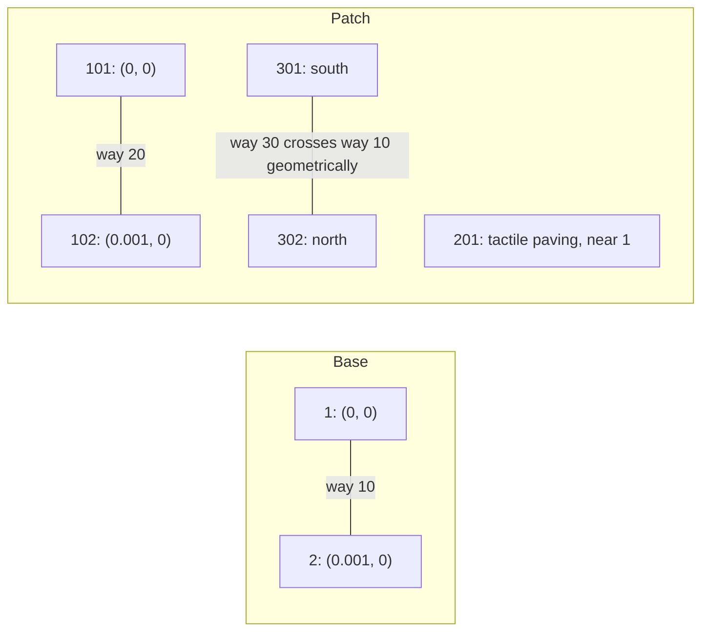
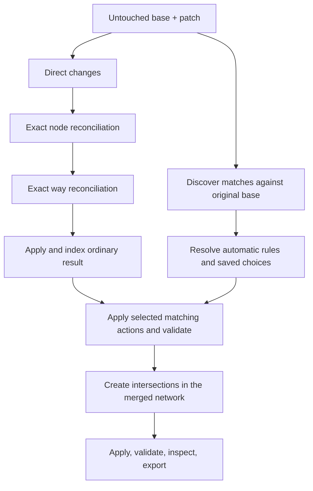
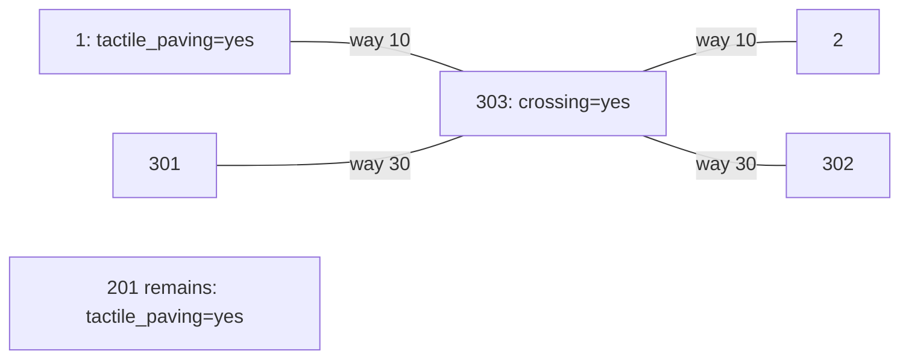
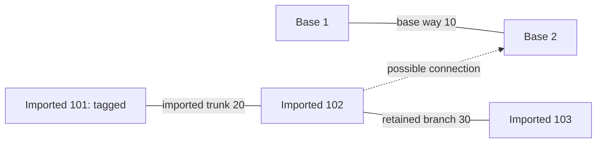
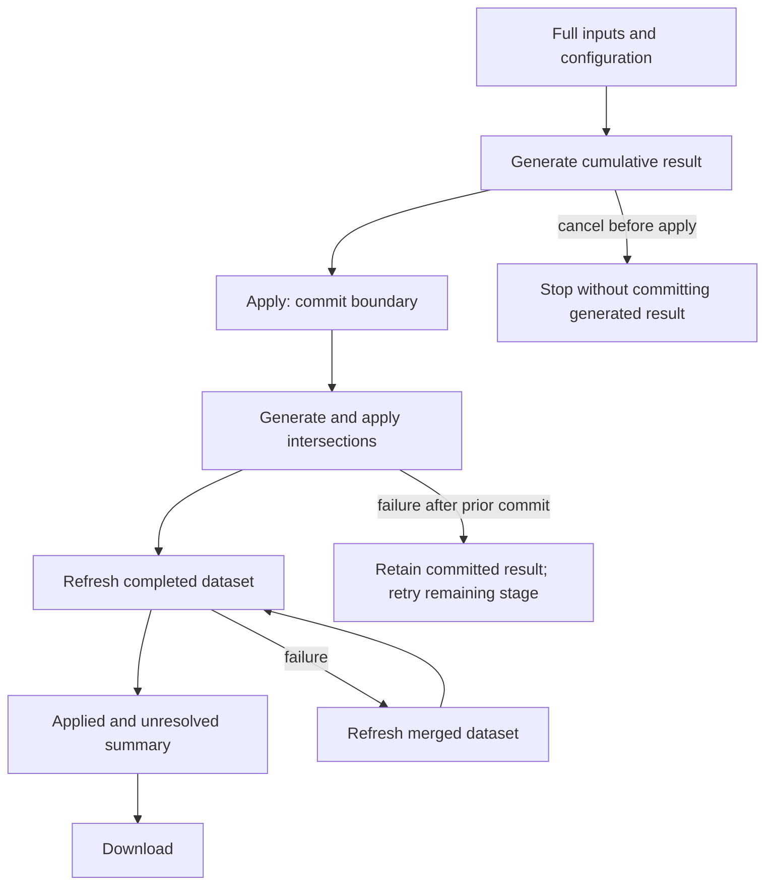
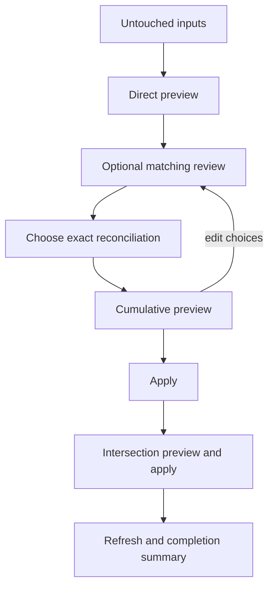

# How Osmix merges two datasets

This is the authoritative behavioral contract for Osmix merging. It explains what happens to entities, attributes, geometry, and connections when a base dataset and an imported patch are combined. It covers the library and the Merge application. Package READMEs document API usage; [CONTEXT.md](../CONTEXT.md) defines the shared vocabulary.

The rules describe the agreed, supported behavior of this revision. Explicit [known gaps](#known-gaps) identify implementation limitations or discrepancies; they are not promises that the implementation already meets. Change this guide and its linked tests in the same PR as a merge behavior change. Diagrams are schematic; coordinates and reference tables specify the examples precisely.

## Contents

- [Inputs and identity](#inputs-and-identity)
- [Worked merge: a sidewalk survey](#worked-merge)
- [Defaults and stage order](#defaults-and-stage-order)
- [Direct merge and exact reconciliation](#direct-and-exact-rules)
- [Imported-data matching](#matching-rules)
- [Copy, connect, and remove: the same geometry](#action-example)
- [Intersection creation and validation](#intersections-and-validation)
- [Automatic and reviewed workflows](#application-workflows)
- [Reading the result](#reading-the-result)
- [Known gaps and follow-ups](#known-gaps)
- [Regression evidence](#regression-evidence)

<a id="inputs-and-identity"></a>

## Inputs and identity

A **base** is the existing dataset. A **patch** contains additions and updates. Osmix produces a combined dataset; it does not interpret absence from the patch as a deletion request.

| OSM concept | Meaning                                                                                              | Example                                                            |
| ----------- | ---------------------------------------------------------------------------------------------------- | ------------------------------------------------------------------ |
| Node        | A point at a longitude and latitude. It can carry attributes or form a way.                          | Node `1`, at `(0, 0)`                                              |
| Way         | An ordered list of node references. A line or area boundary uses those nodes for its geometry.       | Way `10`, references `[1, 2]`                                      |
| Relation    | An ordered list of typed members and roles. It can represent a route, boundary, or turn restriction. | A restriction can refer to a `from` way, `via` node, and `to` way. |
| Tag         | A key-value attribute on an entity.                                                                  | `highway=footway`, `kerb=lowered`                                  |
| Connection  | Ways share the same node reference. Lines merely touching on a map need not be connected.            | `[1, 2]` and `[2, 3]` connect at node `2`.                         |
| Dataset ID  | An identifier for a loaded dataset or merge session.                                                 | A file hash used by the worker                                     |
| Entity ID   | A numeric identifier within an entity type.                                                          | Node `10` and way `10` are different entities.                     |

<a id="mp-i1"></a>
**MP-I1 — Identity comes before geometry.** Base node `10` and patch node `10` are treated as the same entity even if their coordinates or tags differ. File names, dataset IDs, and file hashes do not namespace entity IDs. Matching does not arbitrate these updates by version or timestamp.

For independently prepared GIS imports, verify that shared IDs actually refer to the same features and that new features have non-colliding IDs. Independently converted files can reuse generated negative IDs. The current workflow has no general cross-file ID remapping step; [G1](#gap-g1) explains the consequence. Moving points farther apart does not prevent an ID collision.

<a id="mp-i2"></a>
**MP-I2 — “Authoritative base” has stage-specific boundaries.** Same-ID direct updates can replace base coordinates, tags, references, and relation members. Exact reconciliation chooses base IDs as survivors. Imported-data matching preserves the geometry of the ordinary direct/exact result. Later intersection creation can insert references into base ways or remap a shared junction.

<a id="mp-i3"></a>
**MP-I3 — Load the capabilities the operation needs.** The app requires both inputs in Full mode for merging. Auto must resolve to Full; View supports inspection but not Merge. A View dataset must be reloaded in Full mode. Memory capacity and browser buffer limits can prevent a Full load. The library needs resolved entities, complete required references, and the indexes used by the selected operations. Application rebuilds indexes before later spatial stages. A missing reference can cause generation or validation to fail; merging is not a general repair operation for incomplete extracts.

<a id="mp-i4"></a>
**MP-I4 — Source files and loaded state are different.** Low-level `merge()` returns a result without modifying either input object. Worker/remote `merge()` installs the result in place of the loaded base and removes the loaded patch. The app also changes its in-memory workflow state as stages are applied. None of these operations overwrites the original source files. Download explicitly writes an output file.

### Example MP-E2: a same-ID update is not a tag union

These files have different dataset IDs but both contain node `-1`. Coordinates are `(longitude, latitude)`.

| Entity    | Base                                            | Patch                                   | Result with direct merge enabled                   |
| --------- | ----------------------------------------------- | --------------------------------------- | -------------------------------------------------- |
| Node `-1` | `(0, 0)`; `name=Old entrance`, `wheelchair=yes` | `(0.002, 0)`; `name=Different entrance` | Patch coordinates and tags; `wheelchair` is absent |
| Node `-2` | `(0.001, 0)`; `name=Keep me`                    | Absent                                  | Unchanged                                          |

If these were independently generated IDs for different entrances, the result would be an unintended update. With no stage options, `merge(base, patch)` instead returns the base unchanged. [Executable example MP-E2](../packages/osmix/test/merge-process.test.ts).

<a id="worked-merge"></a>

## Worked merge: a sidewalk survey

**MP-E1** uses a short horizontal base sidewalk, an exact survey copy, an imported tactile-paving point offset by about 0.44 m, and a new vertical path crossing the sidewalk. Coordinates are near the equator to keep the measurements simple; the example is synthetic.

### 1. Read the two inputs

| File  | Node ID | Longitude | Latitude   | Tags                 |
| ----- | ------- | --------- | ---------- | -------------------- |
| Base  | `1`     | `0`       | `0`        | None                 |
| Base  | `2`     | `0.001`   | `0`        | None                 |
| Patch | `101`   | `0`       | `0`        | None                 |
| Patch | `102`   | `0.001`   | `0`        | None                 |
| Patch | `201`   | `0`       | `0.000004` | `tactile_paving=yes` |
| Patch | `301`   | `0.00075` | `-0.001`   | None                 |
| Patch | `302`   | `0.00075` | `0.001`    | None                 |

| File  | Way ID | Ordered references | Tags                                      |
| ----- | ------ | ------------------ | ----------------------------------------- |
| Base  | `10`   | `[1, 2]`           | `highway=footway`, `name=Base sidewalk`   |
| Patch | `20`   | `[101, 102]`       | `highway=footway`, `name=Survey sidewalk` |
| Patch | `30`   | `[301, 302]`       | `highway=footway`, `name=New link`        |

There are no relations. All points and ways are at the default grade. Node `201` is a standalone point, not a vertex of an imported way.



### 2. Enable the intended stages

```ts check-docs change-context
import { merge } from "osmix";

const result = await merge(base, patch, {
  directMerge: true,
  deduplicateNodes: true,
  deduplicateWays: true,
  conflation: {
    propertyKeys: ["tactile_paving"],
    attachNetwork: false,
  },
  createIntersections: true,
});
console.log(result.nodes.size, result.ways.size);
```

Here `base` and `patch` are the loaded datasets in the tables. Copying tactile-paving attributes is enabled; network attachment and explicit way removal are not. The exact stage can still reconcile an exact duplicate, and intersections can still connect crossing paths.



### 3. Follow every entity through the stages

| Stage                        | Nodes present                   | Ways and references                                  | Attribute changes                                                                      |
| ---------------------------- | ------------------------------- | ---------------------------------------------------- | -------------------------------------------------------------------------------------- |
| Direct merge                 | `1, 2, 101, 102, 201, 301, 302` | `10:[1,2]`, `20:[101,102]`, `30:[301,302]`           | All input tags retained on their separate entities                                     |
| Exact nodes                  | `1, 2, 201, 301, 302`           | `20` becomes `[1,2]`; other ways unchanged           | None                                                                                   |
| Exact ways / ordinary result | Same as above                   | `10:[1,2]`, `30:[301,302]`; `20` represented by `10` | Base name wins; `Survey sidewalk` does not replace `Base sidewalk`                     |
| Imported-data matching       | Same as above                   | Unchanged                                            | Node `1` gains `tactile_paving=yes`; `201` remains with its original position and tags |
| Intersections / final result | `1, 2, 201, 301, 302, 303`      | `10:[1,303,2]`, `30:[301,303,302]`                   | New node `303` at `(0.00075,0)` has `crossing=yes`                                     |

Exact reconciliation uses coordinates and ordered references, so it can represent `101`, `102`, and `20` by base entities without proximity matching. Matching finds `201 → 1` from the original inputs. Copying its tag does not remove `201`. Intersection creation then adds a shared point; it retains both way IDs.



The six final nodes and two ways, their tags, and their references are asserted in [MP-E1](../packages/osmix/test/merge-process.test.ts), including PBF export and reload. `303` is the allocated ID for this fixture, not a universal crossing ID. Source datasets are also checked unchanged. This test verifies entity preservation through export, not replication-header correctness; see [G4](#gap-g4).

<a id="defaults-and-stage-order"></a>

## Defaults and stage order

<a id="mp-o1"></a>
**MP-O1 — Choose stages explicitly at the API.** The facade re-exports the library merge behavior. It does not add app defaults.

| Setting                      | `merge()` in change/facade; worker/remote `merge()` | Merge app automatic path | App reviewed path                         |
| ---------------------------- | --------------------------------------------------- | ------------------------ | ----------------------------------------- |
| Direct merge                 | Off                                                 | On                       | Included in cumulative generation         |
| Exact nodes and ways         | Off                                                 | On                       | Controlled by exact reconciliation choice |
| Imported-data matching       | Absent/off                                          | Off until configured     | Optional discovery and decisions          |
| Intersections                | Off                                                 | On                       | Separate later stage                      |
| Within-file diagnostic scans | Not part of merge                                   | Skipped                  | Optional; do not change inputs            |
| Applying generated previews  | Caller responsibility for generator APIs            | Performed by workflow    | Requires the workflow's apply action      |

Matching configuration requires `propertyKeys` and `attachNetwork`. An empty key list disables copying. Radius defaults to **1 m**, `automatic` defaults to `high-confidence`, and `allowWayRemoval` defaults to false. `automatic: "none"` requires individual decisions for otherwise automatic actions. At least one of copying, attachment, or removal assessment must be enabled. Radius must be positive and finite; keys must be nonempty strings. Duplicate keys are deduplicated and sorted.

The app's initial opt-in form selects Copy tags with `barrier,crossing,kerb,tactile_paving`, a 1 m radius, and Connect network and removal off. Routing-affecting keys still require review; selecting a key is not approval of every candidate.

<a id="mp-o2"></a>
**MP-O2 — Discovery and application use different baselines.** Discovery compares untouched patch entities only with the original base. Imported features never become new discovery targets through transitive matching. The ordinary result is direct merge plus the enabled exact stages. Matching changes are applied against that result; intersections come afterward.

The reviewed UI may show discovery before the exact reconciliation choice. It later regenerates the cumulative result from untouched inputs. A direct preview is not an already committed result that subsequent generation blindly edits.

| API composition                                                         | Supported behavior                                                                                                                      |
| ----------------------------------------------------------------------- | --------------------------------------------------------------------------------------------------------------------------------------- |
| `merge(base, patch, options)`                                           | Runs the selected stages in order, returns the final dataset                                                                            |
| `generateChangeset(...)`                                                | Returns an ordinary preview; rejects a defined `conflation` option                                                                      |
| Direct merge plus intersections in one ordinary generation              | Rejected: new ways must first be applied and indexed                                                                                    |
| `generateConflationArtifacts(...)` / `generateConflationChangeset(...)` | Requires direct merge and matching configuration; may include exact stages; rejects intersection creation in that cumulative generation |
| Matching without direct merge                                           | Rejected because ordinary imported additions must be preserved                                                                          |
| Applying a preview                                                      | Distinct from discovering or generating it; only application changes the loaded workflow result                                         |

<a id="direct-and-exact-rules"></a>

## Direct merge and exact reconciliation

<a id="mp-d1"></a>
**MP-D1 — Direct merge is entity replacement by identity.** It adds patch-only entities, replaces differing same-ID entities with the complete patch entity, and preserves base-only entities. Equal entities need no update. Way references are cleaned of adjacent duplicates; nonadjacent repeated references are not generally discarded. Validation still applies to the result. There is no implicit deletion by omission or relation deduplication stage.

### Tag precedence by operation

| Operation                 | Same key has different values                                                                        | Key exists only on patch                                                                         | Key exists only on base                                                     |
| ------------------------- | ---------------------------------------------------------------------------------------------------- | ------------------------------------------------------------------------------------------------ | --------------------------------------------------------------------------- |
| Same-ID direct update     | Patch value                                                                                          | Included                                                                                         | Removed by whole-entity replacement                                         |
| Exact node reconciliation | Blocks the conflicting survivor group                                                                | Copied when the complete group is compatible                                                     | Retained                                                                    |
| Exact way reconciliation  | Descriptive key: base wins. Other semantic differences block, except normalized `oneway` equivalence | Descriptive key may fill a missing base value; other missing semantic values prevent equivalence | Descriptive key retained; other missing semantic values prevent equivalence |
| Matching Copy tags        | Selected, transferable patch value wins after required review                                        | Copied only if selected and eligible                                                             | Retained; a missing patch value never means delete                          |
| Explicit way removal      | Remaining source tags leave with the source way                                                      | Same                                                                                             | Base tags follow any separately selected copying                            |

<a id="mp-x1"></a>
**MP-X1 — Exact nodes need one compatible base survivor.** Coordinates must agree at stored OSM precision (seven decimal places), not merely be close. Same-ID updates are not reinterpreted as imported duplicate nodes. For a patch-created node, there must be exactly one compatible original base candidate. Reconciliation requires:

| Check                | Rule                                                                                                                                                              |
| -------------------- | ----------------------------------------------------------------------------------------------------------------------------------------------------------------- |
| Tags                 | Overlapping keys agree by their stored typed value. Non-conflicting missing values can be combined.                                                               |
| Node grade/access    | Grade and access context must agree under the comparisons below.                                                                                                  |
| Incident ways        | When both nodes have incident ways, every cross-group pair must have compatible grade/access and highway context.                                                 |
| Whole survivor group | All imported nodes proposed for one survivor must agree with each other, not just with a blank base node. A conflict retains every proposed source in that group. |
| Way shape            | Accepted replacements must not reduce a highway to fewer than two distinct nodes. Unsafe replacements are removed before application.                             |
| References           | Accepted source references are rewritten in ways and relations; the base ID survives.                                                                             |

Exact node context compares `access`, `barrier`, `bicycle`, `foot`, `horse`, `motor_vehicle`, `motorcar`, and `vehicle`, treating absence as an empty value. Grade defaults are `bridge=no`, `covered=no`, `layer=0`, `level=` (empty), and `tunnel=no`. Unlike the matching access-key list, this is a bounded list, not a promise to interpret every OSM access key. Incident-way highway presence must agree; this exact-node check does not require equal highway values. Exact-way comparison has the stricter semantic equality rule below. Node tag conflicts independently block even when a key is outside that context list.

<a id="mp-x2"></a>
**MP-X2 — Exact ways need equal ordered references after node reconciliation.** There must be exactly one compatible original base way. `[1,2]` and `[2,1]` are not equal here. Normalized one-way direction must agree; remaining non-descriptive tag keys and values must be equal, including presence. Base IDs and descriptive values survive; missing descriptive values can be filled. References to the replaced way in relations follow the survivor.

Descriptive keys are `alt_name`, `int_name`, `loc_name`, `name`, `note`, `official_name`, `old_name`, `operator`, `ref`, `short_name`, `source`, `wikidata`, and `wikipedia`. Prefixes are `alt_name:`, `name:`, `note:`, `official_name:`, `old_name:`, `operator:`, and `source:`. Keys such as `surface` and `width` are not in this list.

<a id="mp-x3"></a>
**MP-X3 — Normalize direction for comparison, not by rewriting tags.** `oneway=yes/true/1` means forward; `reverse/-1` means reverse; `no/false/0` means both directions. Absent direction uses the supported roundabout implication. Explicit bidirectionality overrides it. Unsupported nonempty values such as `reversible` and `alternating` prevent way matching, even when the text is the same on both ways. Direction values are compared case-insensitively without trimming; an empty value follows the absent-value rule. Original tag spellings remain in the result.

<a id="matching-rules"></a>

## Imported-data matching

Matching proposes correspondences between nearby nodes or ways. It does not establish identity from distance alone, deduplicate relations, or silently accept ambiguous candidates.

<a id="mp-m1"></a>

### MP-M1 — Candidate discovery and measurements

| Subject                 | Discovery rule                                                                                                                                                                  |
| ----------------------- | ------------------------------------------------------------------------------------------------------------------------------------------------------------------------------- |
| Source identity         | Same-ID patch updates are excluded. Base targets whose IDs also occur in the patch are excluded.                                                                                |
| Considered nodes        | Nodes with a configured tag or, when attachment is enabled, incident patch ways; not every imported node necessarily appears in the report.                                     |
| Considered ways         | Ways with configured tags, or ways considered for enabled removal; attachment alone does not create way attachment candidates.                                                  |
| Node distance           | Haversine point-to-point distance within the configured radius                                                                                                                  |
| Way distance            | Both endpoints must fit in the better forward/reverse correspondence, and maximum symmetric sampled separation must fit within the radius.                                      |
| Way geometry sampling   | Samples at most 5 m apart along both lines; each sampled point is compared with the other line's segments. This is sampled evidence, not a proof about every continuous point.  |
| Length difference       | `abs(sourceLength - targetLength) / max(sourceLength, targetLength)` above 0.05 blocks a geometrically plausible way match.                                                     |
| Orientation             | Forward/reverse endpoint-fit differences below `0.000001 m` leave orientation unresolved. One-way or recognized directional-routing cases cannot use an unresolved orientation. |
| Node attachment bearing | Every imported incident segment is compared with compatible base segments. A worst best-fit undirected bearing difference above 30°, or unavailable alignment, requires review. |
| No way counterpart      | Report unmatched. Multiple nearby way indexes can produce `unsupported-way-chain`; that explanation does not prove that those ways form an equivalent chain.                    |

Distance shown in evidence can be rounded to six decimal places. An unavailable measurement differs from a measured distance and from the absence of an eligible target. Segmented or one-to-many geometry is not automatically joined into an equivalent way.

### Routing families and direction

`corridor`, `footway`, `pedestrian`, and `steps` belong to the pedestrian family. `cycleway`, and `path` unless `bicycle=no/private`, belong to bicycle-shared; the remaining `path` case is pedestrian. Pedestrian and bicycle-shared families can be compatible. `bridleway` is classified non-routable for this matching policy. Other nonempty highway values, including unknown ones, are conservatively classified as motor-road. Missing highway and recognized area geometry are non-routable. These families describe matching policy, not full router mode support.

For matching, `area=yes` is an area; a closed way with at least four references and a `building`, `landuse`, `natural`, or `boundary` tag is also an area. Comparing an area with a line blocks the relevant way match. [Intersection filtering currently differs](#gap-g2).

Fuzzy way comparison can account for reversed geometry and normalized one-way direction. Reversed or unresolved orientation with routing keys containing `forward`, `backward`, `left`, or `right`, or keys starting `oneway:`, is blocked. Identical text such as `maxspeed:forward` does not establish equivalent travel meaning after reversal. Closed one-way roundabouts have unresolved endpoint orientation and remain blocked.

<a id="mp-m2"></a>

### MP-M2 — Each action has its own assessment

| Action                                | Can change                                                                                | Preserves / prerequisites                                                                                                           |
| ------------------------------------- | ----------------------------------------------------------------------------------------- | ----------------------------------------------------------------------------------------------------------------------------------- |
| Copy tags (`propertyTransfer`)        | Selected, present, transferable tags on a base counterpart                                | Ordinary-result entity presence, coordinates, way references, and relation members. Routing tags can still change permitted travel. |
| Connect network (`networkAttachment`) | References to accepted base nodes in patch-created routing ways                           | Base geometry and imported nodes; requires supported base and imported routing context. It is a node action, not a way replacement. |
| Remove imported way (`wayRemoval`)    | Explicitly selected redundant imported way and its newly orphaned untagged imported nodes | Retained base counterpart, required branch connections, tagged/base/still-referenced points; see MP-R1.                             |

The candidate's overall status is a summary. An eligible copy action can coexist with a blocked connection. Adding a review reason never weakens an existing hard block. An accept decision, including one supplied through the API, cannot override the affected action's hard restrictions.

| Assessment | Meaning                                                                      |
| ---------- | ---------------------------------------------------------------------------- |
| Automatic  | Eligible for default scheduling under high-confidence rules; not yet applied |
| Review     | Potentially eligible, but requires an explicit decision                      |
| Blocked    | The assessed action cannot currently be selected                             |
| Unmatched  | No supported target for this source                                          |

<a id="mp-m3"></a>

### MP-M3 — Tag and context policies

| Policy                                 | Keys and behavior                                                                                                                                                                                                                              |
| -------------------------------------- | ---------------------------------------------------------------------------------------------------------------------------------------------------------------------------------------------------------------------------------------------- |
| Protected copying                      | `area`, `bridge`, `covered`, `layer`, `level`, `restriction`, `tunnel`, `type`, and `restriction:*` cannot transfer. This list does not imply every namespace of every listed key is protected.                                                |
| Routing-affecting copying              | All access keys below, plus `barrier`, `crossing`, `highway`, `junction`, `kerb`, `maxspeed`, `oneway`, and their colon namespaces require review.                                                                                             |
| Mixed protected/transferable selection | Protected values remain unchanged. Other selected values can transfer after review if all other checks permit it. Selecting only protected or already-equal/absent values produces no copy action.                                             |
| Grade                                  | Compare `layer` (default `0`), `level` (empty), and `bridge/tunnel/covered` (default `no`). For the last three, empty, `0`, `false`, and `no` normalize to the default.                                                                        |
| Access for matching                    | Compare presence and string values, including colon namespaces, for the access keys below. Missing is not automatically equivalent to explicit permission.                                                                                     |
| Node attachment semantics              | Node barrier/access/routing signatures must agree so rewiring does not leave a meaningful control on an unused imported point. Unsupported grade/access, restriction, or reference changes hard-block attachment.                              |
| Relation context                       | Ordinary relation involvement can require review. Involved turn restrictions block supported attachment/way-copy cases rather than becoming overridable review. Removal has stricter relation rules.                                           |
| Routing context                        | Motor-road source attachment, highway/family disagreement without a hard conflict, explicit node grade context, and uncertain bearing require review. Incompatible grade/access, area/routing context, or collapsed references remain blocked. |

The matching access keys are `access`, `agricultural`, `atv`, `bicycle`, `bus`, `caravan`, `carriage`, `coach`, `emergency`, `foot`, `forestry`, `golf_cart`, `goods`, `horse`, `hgv`, `hgv_articulated`, `hov`, `inline_skates`, `mofa`, `moped`, `motorcycle`, `motor_vehicle`, `motorcar`, `motorhome`, `psv`, `ski`, `snowmobile`, `taxi`, `tourist_bus`, `trailer`, `vehicle`, and `wheelchair`.

<a id="mp-m4"></a>

### MP-M4 — Feature classification is independent of selected copy keys

Supported classification keys are `aeroway`, `amenity`, `boundary`, `building`, `craft`, `emergency`, `healthcare`, `historic`, `landuse`, `leisure`, `man_made`, `natural`, `office`, `place`, `power`, `public_transport`, `railway`, `shop`, and `tourism`.

Compare trimmed, case-sensitive values for the same key. Missing/empty values are unknown. `yes` is an unspecified positive subtype and can coexist with a specific positive value; explicit `no` conflicts with a different nonempty value, including `yes`. No cross-key, hierarchy, or semicolon-list equivalence is inferred. Equal classifications do not prove identity.

Thus base `amenity=cafe` versus patch `amenity=school` hard-blocks matching actions even if the only selected copy key is `name`. Ordinary direct/exact rules still determine whether the imported feature remains. Classification checks do not change same-ID replacement into matching.

<a id="mp-m5"></a>

### MP-M5 — Scheduling, alternatives, and conflicts

- Schedule actions for at most one target per imported source. Copying to one target while connecting to another is a conflict. In the app, selecting an alternative replaces that source's prior target choices.
- Copy and connection choices are independent. Changing one preserves the other on the same target. Eligible automatic choices count as scheduled choices until explicitly changed.
- Reject/Skip schedules no matching actions. Leave unmatched rejects every alternative for the source. Both retain ordinary imported additions. Clearing a saved choice restores discovery defaults, potentially rescheduling automatic actions.
- API accept decisions with omitted copy/connect flags select eligible actions; specify false when an action is unwanted. Omitted removal never authorizes removal. Rejected decisions ignore action flags.
- Several sources competing for one target require review. Multiple node copies can be chosen; overlapping values follow deterministic candidate order, and only surviving writes receive outcome credit. Multiple node attachments to one target or multiple way actions to one target are rejected.
- Bulk copy/connect operates across the current filtered collection, not just the visible page, and skips ambiguous or many-to-one cases. Bulk operations do not select removal.
- Generation validates decisions against the complete discovery, untouched inputs, and current options. Public generation recomputes evidence; editing a candidate object cannot authorize an unsafe action. Changing configuration or inputs requires rediscovery and a new preview.

<a id="mp-r1"></a>

### MP-R1 — Explicit way removal

Enable `allowWayRemoval: true` to assess removal. An individual accepted decision must additionally contain `removeWay: true`. Automatic matching, ordinary acceptance, copying tags, and bulk connection never supply removal consent. 

> **Separate tag copying from geometry removal**
> Copying attributes from a matched imported way previously removed that way, which could disconnect imported branches even when network attachment was disabled. Tag copying changes only selected tag values relative to the ordinary direct/exact merge baseline; removal is a separate, default-off choice that requires a supported equivalent base counterpart, verified retained connections, and a preview before application. Retaining overlapping imported geometry is the accepted result whenever removal cannot be established safely, so importing accessibility or descriptive attributes cannot silently discard the user's network.

| Requirement           | Boundary                                                                                                                                                                                                            |
| --------------------- | ------------------------------------------------------------------------------------------------------------------------------------------------------------------------------------------------------------------- |
| Counterpart           | One unique equivalent retained base way; multiple-target/many-to-one and segmented-chain cases block                                                                                                                |
| Geometry              | Open non-area way with no repeated vertices, equal paired vertex counts, finite coordinates, and paired distances within the matching radius                                                                        |
| Semantics             | Compatible direction and equal non-descriptive meaning on ways and paired points; removal uses the descriptive keys/prefixes in MP-X2                                                                               |
| Reversal              | Direction- or side-relative keys/values block when interpretation would change: includes `incline`, `oneway:*`, directional key parts, and non-descriptive values containing `forward/backward/left/right/opposite` |
| Relations             | Involved source/target ways or affected points in relations block; relation membership is not silently removed                                                                                                      |
| Branches              | Every retained branch connection must already reference the required base point or have an eligible **explicitly accepted** node attachment with `attachNetwork: true`                                              |
| Automatic connections | Insufficient as a removal prerequisite, even if they would otherwise be scheduled                                                                                                                                   |
| Revalidation          | Recheck the actual ordinary baseline plus all selected connections/copies before deleting anything. An exact-stage replacement can make a saved removal obsolete; clear it and regenerate.                          |
| Cleanup               | Remove only untagged imported nodes newly orphaned by this removal, with no remaining way/relation references. Retain base, tagged, unrelated, still-referenced, and previously orphaned points.                    |

The preview shows the source and retained way IDs, original source tags, newly orphaned node IDs, retained tagged node IDs, required branch connections, blocked node IDs, and blocking relation IDs. A blocked-node list can represent geometry/routing problems as well as missing attachments. Values on the removed way are lost unless retained separately; copying them is a separate selection.

<a id="action-example"></a>

## Copy, connect, and remove: the same geometry

**MP-E3** uses the MP-E1 base (`1`, `2`, way `10`) with a different patch. Exact reconciliation and intersections are off in this comparison; matching uses `automatic: "none"` so only the stated decisions apply.

| Patch entity | Geometry            | Tags                                      |
| ------------ | ------------------- | ----------------------------------------- |
| Node `101`   | `(0, 0.000004)`     | `name=Survey marker`                      |
| Node `102`   | `(0.001, 0.000004)` | None                                      |
| Node `103`   | `(0.002, 0.000004)` | None                                      |
| Way `20`     | `[101,102]`         | `highway=footway`, `name=Survey sidewalk` |
| Way `30`     | `[102,103]`         | `highway=footway`                         |



| Explicit decisions                                     | Base way `10` name / refs  | Imported way `20`      | Branch `30` | Imported points                                                                      |
| ------------------------------------------------------ | -------------------------- | ---------------------- | ----------- | ------------------------------------------------------------------------------------ |
| Copy `name` from `20 → 10`                             | `Survey sidewalk`; `[1,2]` | Remains `[101,102]`    | `[102,103]` | All remain                                                                           |
| Connect `102 → 2`                                      | `Base sidewalk`; `[1,2]`   | Remains, now `[101,2]` | `[2,103]`   | All remain                                                                           |
| Copy `name`, explicitly connect `102 → 2`, remove `20` | `Survey sidewalk`; `[1,2]` | Removed                | `[2,103]`   | All remain: `101` is tagged; `102` was already orphaned by connection before removal |

An attempted removal without the branch prerequisite is blocked. Automatic connection alone does not satisfy it. In a standalone untagged trunk without a retained branch, removal can instead clean up its newly orphaned untagged points. It never performs a global sweep of unused points.

The three rows have named [MP-E3 tests](../packages/osmix/test/merge-process.test.ts), with complete way/node comparisons and PBF reload. The [explicit removal tests](../packages/change/test/conflation-way-removal.test.ts) additionally cover missing branch consent and scoped cleanup.

<a id="intersections-and-validation"></a>

## Intersection creation and validation

<a id="mp-j1"></a>
**MP-J1 — Intersections are a later connectivity operation.** Surviving patch way IDs are compared with the merged dataset, including other imported ways. Rebuilt indexes include direct additions and accepted attachments. Geometric crossings between eligible ways with equal grade signatures may become shared nodes. There is no new global base-only-versus-base-only cleanup pass.

| Rule                  | Behavior                                                                                                                                                                                                               |
| --------------------- | ---------------------------------------------------------------------------------------------------------------------------------------------------------------------------------------------------------------------- |
| Way eligibility       | Highway/footway-style ways under the current predicate; truthy `building`, `landuse`, or `natural` tags exclude a way. The area limitation in G2 applies.                                                              |
| Grade                 | Equal normalized `layer`, `level`, `bridge`, `tunnel`, and `covered` context for a new crossing                                                                                                                        |
| Existing close vertex | May reuse a vertex strictly less than 1 m from the computed crossing; this threshold is independent of imported-data matching radius                                                                                   |
| New node              | If supported reuse is unavailable, allocate a new unused safe integer ID at the crossing                                                                                                                               |
| Result                | Insert shared references into existing ordered ways; keep way IDs. This does not split a way into multiple way entities.                                                                                               |
| Crossing tag          | New crossing nodes receive `crossing=yes`. Reused/shared nodes can gain it if absent; an existing crossing value is retained.                                                                                          |
| Existing junction     | Preserve all affected incident-way connections and supported via-node restriction references together. A bridge entrance can be an existing junction despite differing incident grades.                                |
| Unsafe substitution   | Skip a shared-junction change that would collapse a way, detach a restriction, or break grade connectivity. An isolated unrestricted endpoint may instead use a new crossing node when reuse would degenerate its way. |

Turning off imported-data matching does **not** make the entire workflow coordinate-exact if intersections are enabled. Intersection reuse can connect a nearby vertex. Visual overlap also does not establish permission for travel: these intersection rules are not a complete access or routing model.

<a id="mp-v1"></a>
**MP-V1 — Application rejects new supported integrity violations.** Checks cover missing node/way/relation references, highways with fewer than two distinct nodes, detached restriction members, and incompatible interior grade connections. Existing base defects may remain. Inherited patch grade issues have limited allowances; patch missing references, degenerate highways, and patch-only restriction defects do not exempt new failures in the result. This is validation against known issues, not a guarantee that either input or the result is error-free.

Matching additionally verifies preservation of the ordinary-result base topology. The worker's automatic-attachment CAR check compares routable-node, directed-edge, and weak-component counts for the automatic-attachment projection. Its scope differs from direct library calls. Neither those counts nor integrity checks prove that all routes, restrictions, accessibility modes, or travel permissions are unchanged; see [G3](#gap-g3).

<a id="mp-v2"></a>
**MP-V2 — A saved preview is bound to its inputs.** Serialized changesets carry versioned input identities. Restore against the original base and the original patches in generation order. Changed entities, coordinates, references, tags, or ordering covered by that identity invalidate restoration. Legacy snapshots without input identity data must pass base-only validation; supplying patches cannot grant new inherited exemptions. Storage ordering can affect identity hashes, which detect inconsistent inputs but do not authenticate a saved file. The app’s Download JSON changes action exports a diagnostic change array, not a restorable changeset snapshot. An outcome report alone is not a changeset or a backup of the inputs. Worker recovery must restore the latest generated changeset and associated reviewed state before application.

<a id="application-workflows"></a>

## Automatic and reviewed workflows

### Automatic merge

1. Load both inputs in Full mode and inspect their roles and identity assumptions.
2. Configure optional matching. Removal remains an individual review action; use the reviewed workflow to select it.
3. Run automatic merge. Diagnostics and intermediate user checkpoints are skipped.
4. Generate and apply the direct/exact result, with selected automatic matching when enabled.
5. Run and apply intersections.
6. Refresh the completed dataset and read the prominent applied/unresolved summary before downloading.



Automatic mode completes with unresolved work reported; it does not silently accept ambiguous or blocked candidates. Unresolved does not necessarily mean the imported entity was omitted. Direct additions can remain disconnected or have attributes still uncopied.

### Review each merge stage

1. Select inputs and optionally run within-file duplicate diagnostics. Diagnostics change neither input.
2. Generate and inspect the direct preview. This has not committed the cumulative merge.
3. If matching is enabled, discover candidates from the original inputs, inspect evidence, and select actions. Review all alternatives for a source together.
4. Choose exact reconciliation and generate the cumulative direct/exact/matching preview. Recheck removal dependencies and actual outcomes. Editing choices requires a new preview.
5. Apply the cumulative preview.
6. Generate, inspect, and apply intersections against that result.
7. Refresh, inspect the completion summary, and download.



<a id="review-controls"></a>

### Review controls and removal prerequisites

**Compare** changes the highlighted source/target pair without selecting matching actions. The map uses base circles/solid lines and imported diamonds/dashed lines at their actual coordinates. **Match evidence and attributes** exposes selectable coordinates, measured differences, base/imported values, and text explanations for protected or routing-affecting keys. For ways, the displayed coordinates identify the endpoints. Filters, target choices, independent action toggles, comparison, and expanded evidence are keyboard accessible; a short distance does not override a blocked action.

With **Review redundant way removal** enabled, automatic merge is unavailable. Use **Review connection at imported point…** for a branch prerequisite. If its connection is already scheduled automatically, **Confirm connection for removal** records explicit consent without toggling it off and on. Return to the way and select **Remove imported way** once eligible. Review the complete **Way removal preview** before **Apply cumulative merge**. Editing any choice clears that preview and requires regeneration. Select **Copy tags** separately for source values that should remain on the base.

An older session can contain conflicting target decisions. Its candidates remain readable so each affected source can be corrected or left unmatched. Generation and bulk scheduling stay blocked until the complete decision set is valid. Before application, **Back to matching** preserves the original inputs/options/decisions for correction; it is not an undo action after commit.

<a id="mp-w1"></a>

### MP-W1 — Cancellation and recovery

| Situation                                  | Meaning and next step                                                                                                                                              |
| ------------------------------------------ | ------------------------------------------------------------------------------------------------------------------------------------------------------------------ |
| Cancellation before application            | Generated work can be abandoned without installing it. Cancellation is checked at workflow boundaries; a running worker operation may finish first.                |
| Request arrives after commit               | It cannot roll back the committed dataset. Treat commit status as authoritative rather than assuming the cancellation request won the race.                        |
| Intersections fail after merge application | Keep the committed cumulative result and expose the remaining-stage retry. Do not present a fully completed download.                                              |
| Result committed but UI refresh fails      | Refresh the merged dataset; do not rerun the merge against changed inputs. Completion/download stays unavailable until refresh succeeds.                           |
| Worker/replica recovery                    | Restore current inputs and the latest generated/reviewed state; synchronize committed data before refreshing. A stale earlier preview must not replace newer work. |
| Input replacement or rediscovery           | Clear stale decisions, generated removal evidence, and completion as appropriate. A new extracted base must not inherit the previous merge's completion summary.   |
| Restart from source                        | Original files remain available. Reloading starts a new workflow; this is distinct from rollback of already committed in-memory work.                              |

These states are exercised by the [application workflow tests](../apps/merge/tests/merge-workflow.test.ts), [worker tests](../packages/osmix/test/conflation-way-removal.test.ts), and [real-browser journey](../apps/merge/e2e/merge-base-loading.spec.ts). The app's review order and worker recovery are application behavior, not extra default stages in the library API.

<a id="reading-the-result"></a>

## Reading the result

<a id="mp-out1"></a>
**MP-OUT1 — Count changes, not promises.** Candidate eligibility, scheduled actions, generated previews, and completed application are distinct. Matching outcomes compare the ordinary baseline with the matching result **before intersections**. A workflow reports them as completed only after its required application/stages and refresh succeed.

| Report concept            | Interpretation                                                                                                        |
| ------------------------- | --------------------------------------------------------------------------------------------------------------------- |
| Candidate count           | Proposed source/target rows. Several rows can describe one imported source.                                           |
| Considered feature count  | Unique imported nodes/ways considered by matching; not all imported entities                                          |
| Copied action             | One source with one or more surviving copied values; copying three keys is one action                                 |
| Connection action         | One matched imported node with one or more actually changed way references                                            |
| Removal action            | One explicitly removed imported way; newly cleaned orphan points are counted separately                               |
| Already equal             | Selected value was already present; no copy action occurred                                                           |
| Superseded copy           | Another accepted source owns the surviving value; the overwritten copy does not receive surviving-copy credit         |
| Unresolved                | A source has ambiguous, review, blocked, or unmatched work. A source can also have an applied action.                 |
| Deliberate skip           | A chosen absence of matching actions; separate from unresolved work                                                   |
| Retained imported feature | Retained under the reported stage's ordinary/matching rules; not evidence that copying or network connection happened |
| Original ID absent        | May mean exact representation under a base ID, or explicit removal. Determine which stage changed it.                 |

Do not add applied and unresolved counts as if they partitioned all imported data. A source can have successful copying and a blocked connection. Missing imported tag values are excluded from per-key present-value counts, while present uncopied values have explanations such as blocked, not selected, protected, no accepted target, or superseded. Exact reference reconciliation receives no fuzzy-attachment credit. Later intersections may change connectivity without changing the matching report.

Download the PBF for the resulting dataset and use the changes/outcome report for review. **Start a new merge** clears both input slots, map selection, and the prior report; load the original files again to revise a completed merge. PBF entity round-trip tests do not validate all header metadata, and downloading a file does not upload changes to OpenStreetMap.

<a id="known-gaps"></a>

## Known gaps and follow-ups

These entries are follow-up references for unresolved limitations. Their IDs are stable. No runtime fix is included in establishing this guide. Where the desired replacement policy is not yet agreed, that fact is explicit rather than inventing a future rule.

<a id="gap-g1"></a>

### G1 — Independent imports can collide on entity IDs

**Observed:** The [GeoJSON converter](../packages/geojson/src) generates negative IDs starting at `-1` per entity type for independent imports and can use numeric/parseable feature IDs. Dataset IDs do not prevent collisions during direct merge. MP-E2 demonstrates the resulting whole-entity replacement.

**User impact:** Two unrelated imported entrances or sidewalks can be interpreted as updates. This is a supported identity rule combined with an import limitation, not proof that arbitrary converted GIS files can safely combine.

**Required now:** Shared IDs must mean shared identity; callers must allocate non-colliding IDs for additions. **Follow-up:** Define import namespacing/remapping and preserve all references before changing this policy. A specific automated allocation policy has not been agreed.

<a id="gap-g2"></a>

### G2 — Intersection filtering does not exclude every area representation

**Observed:** [Intersection eligibility](../packages/change/src/utils.ts) excludes truthy `building`, `landuse`, or `natural` tags. `highway=pedestrian` with `area=yes` alone can remain eligible; `boundary` alone is also not the general area exclusion previously claimed in the README.

**User impact:** A polygonal representation can participate in line-style intersection processing. **Contract boundary:** Treating all polygonal ways as excluded is not currently supported. **Follow-up:** Specify and test a shared area policy before claiming complete polygon exclusion. This guide corrects the broad documentation claim without changing the predicate.

<a id="gap-g3"></a>

### G3 — Routing safeguards have limited scope

**Observed:** [Worker matching generation](../packages/osmix/src/worker.ts) includes the automatic-attachment CAR projection check. The direct library/facade merge function does not add it. [Integrity validation](../packages/change/src/integrity.ts) checks specific reference and topology issues, not every route or travel mode.

**User impact:** Counts can agree while routes differ, and selected routing tags can intentionally change access. **Contract boundary:** Source geometry preservation is not universal routing equivalence. **Follow-up:** Define route/mode-specific acceptance criteria and validate representative journeys when that guarantee is required. Existing routing diagnostics remain evidence within their declared scope.

<a id="gap-g4"></a>

### G4 — PBF replication timestamp export is incorrect

**Observed:** [PBF export](../packages/load/src/entity-stream.ts) writes `Date.now()` into `osmosis_replication_timestamp`. The [PBF schema](../packages/pbf/src/proto/osmformat.proto) specifies seconds; JavaScript supplies milliseconds. Export time also does not establish a valid replication state. This predates these documentation changes.

**User impact:** Consumers can see implausible future dates or misleading replication provenance even when entities reload correctly. **Required behavior:** Replication metadata must describe an established replication state in the specified units. **Follow-up:** Decide when provenance can be preserved and when it must be omitted after edits/merges, then test headers. Replacing milliseconds with the current time in seconds alone is insufficient.

<a id="regression-evidence"></a>

## Regression evidence

Rules above are the specification. Tests provide evidence for particular scenarios, not proof of every broad claim. The guide's named fixtures deliberately use small explicit data; the larger suite covers additional combinations. Rule anchors remain stable when prose moves.

| Rules / scenario                                                               | Regression evidence                                                                                                                                                                                                                                  |
| ------------------------------------------------------------------------------ | ---------------------------------------------------------------------------------------------------------------------------------------------------------------------------------------------------------------------------------------------------- |
| MP-I1, MP-D1, MP-O1: ID collision, whole replacement, omission, no-op defaults | [Guide tests](../packages/osmix/test/merge-process.test.ts), `MP-E2 distinguishes no-op defaults, whole-entity updates, and absent entities`                                                                                                         |
| MP-X1/X2, MP-M2, MP-J1: complete walkthrough and exported entities             | [Guide tests](../packages/osmix/test/merge-process.test.ts), `MP-E1 traces direct, exact, matching, and intersections through PBF reload`                                                                                                            |
| MP-M2, MP-R1: action comparison on identical inputs                            | [Guide tests](../packages/osmix/test/merge-process.test.ts), `MP-E3 compares … on the same imported sidewalk and branch` (copy, connect, copy-connect-remove)                                                                                        |
| MP-X1: conflicting sources sharing one survivor                                | [Exact node groups](../packages/change/test/exact-node-groups.test.ts)                                                                                                                                                                               |
| MP-X2/X3: ordered geometry and direction aliases                               | [Way direction](../packages/change/test/way-direction.test.ts), [routing integrity](../packages/change/test/routing-integrity.test.ts)                                                                                                               |
| MP-M1/M3: action-specific hard blocks and uncertain direction                  | [Matching blockers](../packages/change/test/conflation-blockers.test.ts), [matching cases](../packages/change/test/conflation.test.ts)                                                                                                               |
| MP-M4: classification conflicts independent of copy keys                       | [Feature-type cases](../packages/change/test/conflation-feature-types.test.ts)                                                                                                                                                                       |
| MP-M5: alternatives and independently selected actions                         | [Target selection](../packages/change/test/conflation-targets.test.ts), [action selection](../packages/change/test/conflation-actions.test.ts)                                                                                                       |
| MP-R1: explicit branch dependency                                              | [Removal tests](../packages/change/test/conflation-way-removal.test.ts), `blocks a retained branch until its connection is explicitly selected`                                                                                                      |
| MP-R1: stale deletion after exact reconciliation                               | [Removal tests](../packages/change/test/conflation-way-removal.test.ts), `rejects an exact-stage remap that makes the reviewed deletion obsolete`                                                                                                    |
| MP-J1: restrictions and degenerate endpoint reuse                              | [Intersections](../packages/change/test/intersections.test.ts), `rewrites via-node relation members when coincident way nodes are unified`; `creates a dedicated node when endpoint reuse would collapse a short patch way`                          |
| MP-V1/V2: reference validation and restored inputs                             | [Routing integrity](../packages/change/test/routing-integrity.test.ts), [serialization](../packages/change/test/changeset-serialization.test.ts)                                                                                                     |
| MP-OUT1: partial outcomes and exact-versus-fuzzy credit                        | [Outcomes](../packages/change/test/conflation-outcomes.test.ts), `counts one copy action per source with multiple changed keys and keeps partial failures`; `does not credit fuzzy matching for refs already reconciled by the ordinary exact merge` |
| MP-W1: late cancellation, refresh recovery, new inputs                         | [Browser journey](../apps/merge/e2e/merge-base-loading.spec.ts), `a late cancellation preserves the committed exact result and a new extracted base clears completion`                                                                               |
| MP-W1/MP-R1: removal preview and rediscovery                                   | [Browser journey](../apps/merge/e2e/merge-base-loading.spec.ts), `manual removal requires preview and rediscovery clears stale removal evidence before apply`                                                                                        |

Implementation entry points for maintainers: [pipeline](../packages/change/src/merge.ts), [direct/exact/intersections](../packages/change/src/changeset.ts), [matching](../packages/change/src/conflation.ts), [removal](../packages/change/src/internal/way-removal.ts), and [application orchestration](../apps/merge/src/lib/merge-workflow.ts). Use these to investigate discrepancies; update the behavioral contract deliberately rather than silently replacing it with whatever the code happens to do.
