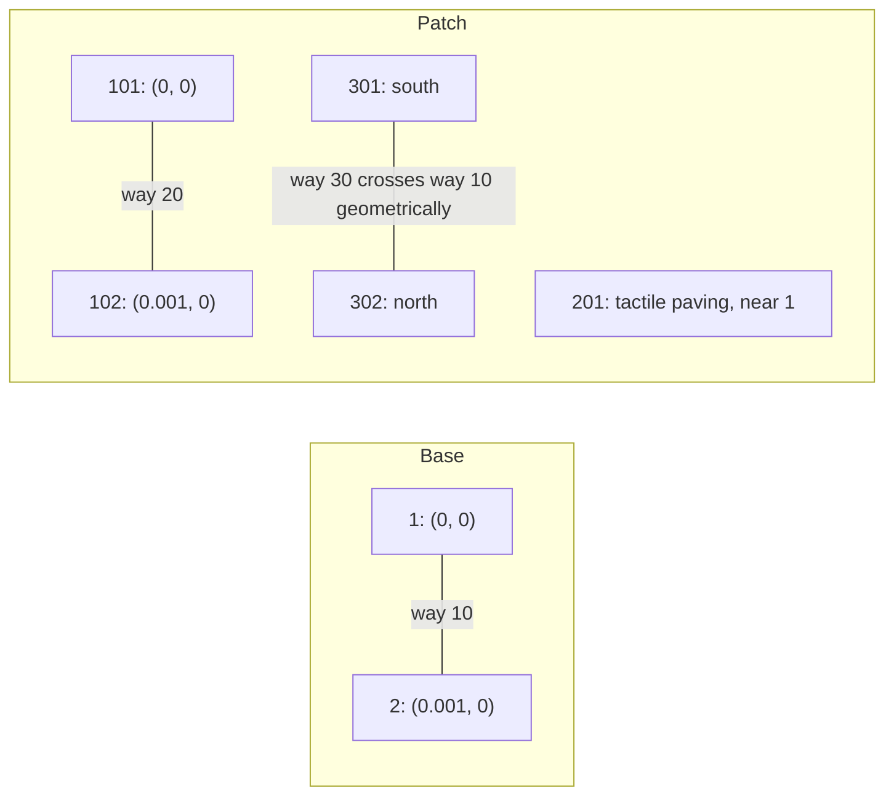
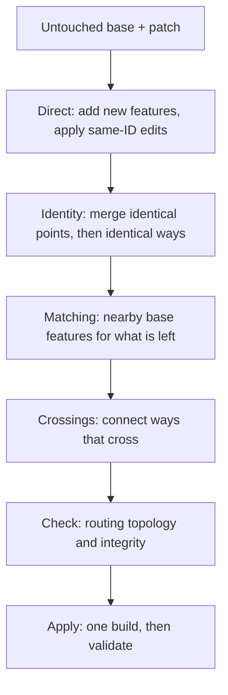
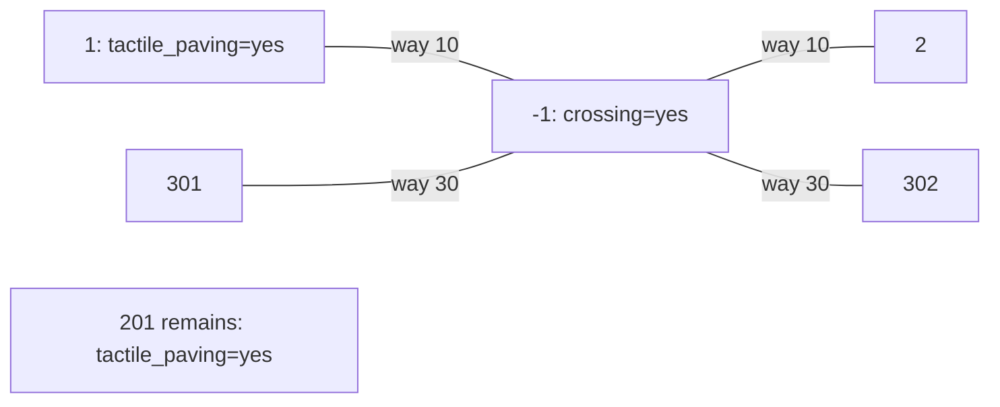
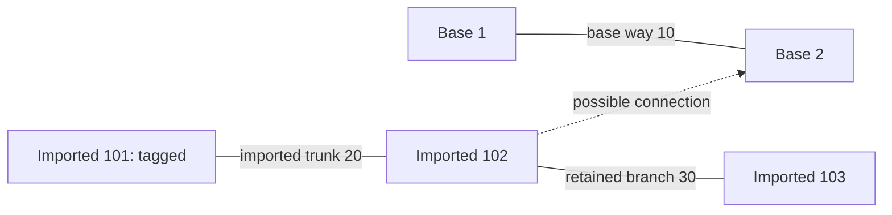
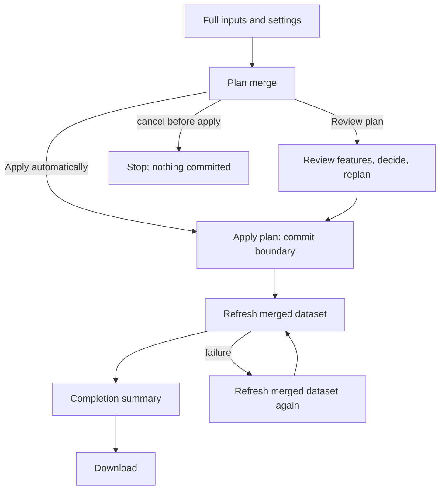

# How Osmix merges two datasets

This is the authoritative behavioral contract for Osmix merging. It explains what happens to entities, attributes, geometry, and connections when a base dataset and an imported patch are combined. It covers the library and the Merge application. Package READMEs document API usage; [CONTEXT.md](../CONTEXT.md) defines the shared vocabulary.

The rules describe the agreed, supported behavior of this revision. Explicit [known gaps](#known-gaps) identify implementation limitations or discrepancies; they are not promises that the implementation already meets. Change this guide and its linked tests in the same PR as a merge behavior change. Diagrams are schematic; coordinates and reference tables specify the examples precisely.

## Contents

- [Inputs and identity](#inputs-and-identity)
- [Worked merge: a sidewalk survey](#worked-merge)
- [The plan: phases, proposals, decisions](#defaults-and-stage-order)
- [Direct merge and exact reconciliation](#direct-and-exact-rules)
- [Imported-data matching](#matching-rules)
- [Copy, connect, and remove: the same geometry](#action-example)
- [Intersection creation and validation](#intersections-and-validation)
- [Review plan and Apply automatically](#application-workflows)
- [Reading the result](#reading-the-result)
- [Known gaps and follow-ups](#known-gaps)
- [Regression evidence](#regression-evidence)

<a id="inputs-and-identity"></a>

## Inputs and identity

A **base** is the existing dataset. A **patch** contains additions and updates. Osmix produces a combined dataset; it does not interpret absence from the patch as a deletion request.

| OSM concept | Meaning                                                                                              | Example                                                            |
| ----------- | ---------------------------------------------------------------------------------------------------- | ------------------------------------------------------------------ |
| Node        | A point at a longitude and latitude. It can carry attributes or form a way.                          | Node `1`, at `(0, 0)`                                              |
| Way         | An ordered list of node references. A line or area boundary uses those nodes for its geometry.       | Way `10`, references `[1, 2]`                                      |
| Relation    | An ordered list of typed members and roles. It can represent a route, boundary, or turn restriction. | A restriction can refer to a `from` way, `via` node, and `to` way. |
| Tag         | A key-value attribute on an entity.                                                                  | `highway=footway`, `kerb=lowered`                                  |
| Connection  | Ways share the same node reference. Lines merely touching on a map need not be connected.            | `[1, 2]` and `[2, 3]` connect at node `2`.                         |
| Dataset ID  | An identifier for a loaded dataset or merge session.                                                 | A file hash used by the worker                                     |
| Entity ID   | A numeric identifier within an entity type.                                                          | Node `10` and way `10` are different entities.                     |

<a id="mp-i1"></a>
**MP-I1 — Patch IDs follow the OSM convention.** A positive patch ID names an existing entity: base node `10` and patch node `10` are the same entity even if their coordinates or tags differ, and the patch version replaces it. Matching does not arbitrate these edits by version or timestamp. A negative patch ID is a new feature. Before planning, negative patch IDs move below the base's lowest ID (with references and members), so independent imports that both number new features from `-1` never collide. When a patch's positive IDs are not meant as edits, read every patch ID as new (`patchIds: "new"`, **Treat all as new** in the app); the plan counts the patch entities that would replace base entities so this is visible before applying.

<a id="mp-i2"></a>
**MP-I2 — “Authoritative base” has phase-specific boundaries.** Same-ID direct updates can replace base coordinates, tags, references, and relation members. Identical-point merges choose base IDs as survivors. Imported-data matching preserves the geometry of the planned state it reads, except where you include a way replacement ([MP-R2](#mp-r2)): it deletes the base ways an imported way traces, and nothing else of the base. Crossings can insert references into base ways or remap a shared junction, but never merge two base nodes.

<a id="mp-i3"></a>
**MP-I3 — Load the capabilities the operation needs.** The app requires both inputs in Full mode for merging. Auto must resolve to Full; View supports inspection but not Merge. A View dataset must be reloaded in Full mode. Memory capacity and browser buffer limits can prevent a Full load. The library needs resolved entities, complete required references, and the indexes used by the selected operations. Application rebuilds indexes before later spatial stages. A missing reference can cause generation or validation to fail; merging is not a general repair operation for incomplete extracts.

<a id="mp-i4"></a>
**MP-I4 — Source files and loaded state are different.** `planMerge()`, `applyPlan()` and `merge()` return results without modifying either input object. Worker/remote `applyMergePlan()` and `merge()` install the result in place of the loaded base and remove the loaded patch. None of these operations overwrites the original source files. Download explicitly writes an output file.

<a id="mp-i5"></a>
**MP-I5 — Remove duplicates inside each input before merging.** Merge does not scan or fix duplicates inside one file. Open each input on the app's Inspect page first. Its scan (`planWithinDatasetDeduplication`) finds nodes at the same seven-decimal coordinate and ways with identical ordered references, using the same compatibility checks as exact reconciliation. Applying the scan deletes each duplicate in favor of the compatible entity with the highest ID and rewrites way references and relation members to that survivor. Send the cleaned dataset to Merge with **Open in**, or export the cleaned PBF and load it there. Duplicates left inside the patch are passed to direct merge unchanged.

### Example MP-E2: new IDs never collide; positive IDs edit whole entities

The base came from an earlier import numbered from `-1`; the patch is a new import that also starts at `-1`, plus an edit of base node `7`. Coordinates are `(longitude, latitude)`.

| Entity    | Base                                            | Patch                                   | Result                                            |
| --------- | ----------------------------------------------- | --------------------------------------- | ------------------------------------------------- |
| Node `-1` | `(0, 0)`; `name=Old entrance`, `wheelchair=yes` | `(0.002, 0)`; `name=Different entrance` | Base node unchanged; the patch point is node `-3` |
| Node `-2` | `(0.001, 0)`; `name=Keep me`                    | Absent                                  | Unchanged                                         |
| Node `7`  | `name=Main`, `wheelchair=yes`                   | Same point; `name=Main entrance`        | Patch tags; `wheelchair` is absent                |

[Executable example MP-E2](../packages/osmix/test/merge-process.test.ts).

<a id="worked-merge"></a>

## Worked merge: a sidewalk survey

**MP-E1** uses a short horizontal base sidewalk, an exact survey copy, an imported tactile-paving point offset by about 0.44 m, and a new vertical path crossing the sidewalk. Coordinates are near the equator to keep the measurements simple; the example is synthetic.

### 1. Read the two inputs

| File  | Node ID | Longitude | Latitude   | Tags                 |
| ----- | ------- | --------- | ---------- | -------------------- |
| Base  | `1`     | `0`       | `0`        | None                 |
| Base  | `2`     | `0.001`   | `0`        | None                 |
| Patch | `101`   | `0`       | `0`        | None                 |
| Patch | `102`   | `0.001`   | `0`        | None                 |
| Patch | `201`   | `0`       | `0.000004` | `tactile_paving=yes` |
| Patch | `301`   | `0.00075` | `-0.001`   | None                 |
| Patch | `302`   | `0.00075` | `0.001`    | None                 |

| File  | Way ID | Ordered references | Tags                                      |
| ----- | ------ | ------------------ | ----------------------------------------- |
| Base  | `10`   | `[1, 2]`           | `highway=footway`, `name=Base sidewalk`   |
| Patch | `20`   | `[101, 102]`       | `highway=footway`, `name=Survey sidewalk` |
| Patch | `30`   | `[301, 302]`       | `highway=footway`, `name=New link`        |

There are no relations. All points and ways are at the default grade. Node `201` is a standalone point, not a vertex of an imported way.


```mermaid
flowchart LR
  subgraph Base
    B1["1: (0, 0)"] ---|"way 10"| B2["2: (0.001, 0)"]
  end
  subgraph Patch
    P101["101: (0, 0)"] ---|"way 20"| P102["102: (0.001, 0)"]
    P301["301: south"] ---|"way 30 crosses way 10 geometrically"| P302["302: north"]
    P201["201: tactile paving, near 1"]
  end
```

### 2. Configure matching

```ts check-docs change-context
import { merge } from "osmix";

const result = await merge(base, patch, {
  matching: { propertyKeys: ["tactile_paving"], attachNetwork: false },
});
console.log(result.nodes.size, result.ways.size);
```

Here `base` and `patch` are the loaded datasets in the tables. Copying tactile-paving attributes is enabled; network attachment and explicit way removal are not. By default identical points still merge into the base, and crossings still connect.


```mermaid
flowchart TD
  Inputs["Untouched base + patch"] --> Direct["Direct: add new features, apply same-ID edits"]
  Direct --> Identity["Identity: merge identical points, then identical ways"]
  Identity --> Matching["Matching: nearby base features for what is left"]
  Matching --> Crossings["Crossings: connect ways that cross"]
  Crossings --> Check["Check: routing topology and integrity"]
  Check --> Apply["Apply: one build, then validate"]
```

Every phase records its changes in one plan; nothing is built until the plan is applied.

### 3. Follow every entity through the phases

| Phase     | Proposals (applied)                                   | Nodes present                   | Ways and references                                  | Attribute changes                                                                      |
| --------- | ----------------------------------------------------- | ------------------------------- | ---------------------------------------------------- | -------------------------------------------------------------------------------------- |
| Direct    | `add:w20`, `add:w30`, `add:n201`                      | `1, 2, 101, 102, 201, 301, 302` | `10:[1,2]`, `20:[101,102]`, `30:[301,302]`           | All input tags retained on their separate entities                                     |
| Identity  | `exact:n101>n1`, `exact:n102>n2`, `reconcile:w20>w10` | `1, 2, 201, 301, 302`           | `10:[1,2]`, `30:[301,302]`; `20` represented by `10` | Base name wins; `Survey sidewalk` does not replace `Base sidewalk`                     |
| Matching  | `copy:n201>n1`                                        | Same as above                   | Unchanged                                            | Node `1` gains `tactile_paving=yes`; `201` remains with its original position and tags |
| Crossings | `xnode:w30\|w10@0.0007500,0.0000000`                  | `-1, 1, 2, 201, 301, 302`       | `10:[1,-1,2]`, `30:[301,-1,302]`                     | New node `-1` at `(0.00075,0)` has `crossing=yes`                                      |

Identical-point merges use coordinates and ordered references, so they represent `101`, `102`, and `20` by base entities without proximity matching. Matching then reads the planned state: `101` and `102` are already base points, so only `201 → 1` is a candidate. Copying its tag does not remove `201`. The crossing adds a shared point; it retains both way IDs.


```mermaid
flowchart LR
  N1["1: tactile_paving=yes"] ---|"way 10"| NX["-1: crossing=yes"]
  NX ---|"way 10"| N2["2"]
  N301["301"] ---|"way 30"| NX
  NX ---|"way 30"| N302["302"]
  N201["201 remains: tactile_paving=yes"]
```

The six final nodes and two ways, their tags, and their references are asserted in [MP-E1](../packages/osmix/test/merge-process.test.ts), including PBF export and reload. A new crossing node is a new entity, so it gets the next negative ID below every node in the planned result (`-1` here). Source datasets are also checked unchanged. This test verifies entity preservation through export, not replication-header correctness; see [G4](#gap-g4).

<a id="defaults-and-stage-order"></a>

## The plan: phases, proposals, decisions

<a id="mp-o1"></a>
**MP-O1 — One plan per merge, applied once.** `planMerge(base, patch, options)` runs the phases in order and records every change as pending records in one overlay of the base; no phase builds the dataset. `applyPlan(plan)` materializes the records in a single build and validates the result (MP-V1). `merge()` is `applyPlan(planMerge(...))` with the Merge app's defaults:

| Setting                     | Default                             | Option                           |
| --------------------------- | ----------------------------------- | -------------------------------- |
| Direct and same-ID changes  | Always                              | `patchIds` (MP-I1)               |
| Identical points and ways   | Merged automatically                | `mergeIdenticalPoints`           |
| Imported-data matching      | Off until configured                | `matching`                       |
| Automation level            | Recommended ([MP-M6](#mp-m6))       | `automation`                     |
| Crossings                   | Connected automatically             | `createIntersections`            |
| Within-file duplicate fixes | Not part of merge ([MP-I5](#mp-i5)) | `planWithinDatasetDeduplication` |

Matching configuration requires `propertyKeys` and `attachNetwork`. An empty key list disables copying. Radius defaults to **1 m**, `automatic` defaults to `high-confidence`, `allowWayRemoval` and `allowWayReplacement` default to false, and `replacementToleranceMeters` defaults to **1 m**. `automatic: "none"` puts otherwise automatic actions in review. At least one of copying, attachment, removal assessment or replacement must be enabled. Radius must be positive and finite; keys must be nonempty strings. Duplicate keys are deduplicated and sorted.

The app's initial opt-in form selects Copy tags with `barrier,crossing,kerb,tactile_paving`, a 1 m radius, and Connect network, removal and replacement off. Routing-affecting keys still require review; selecting a key is not approval of every candidate. Choosing the Aggressive automation level is that approval for copies with no competing choice ([MP-M6](#mp-m6)).

<a id="mp-o2"></a>
**MP-O2 — Each phase reads the state the earlier phases planned.** Matching discovers candidates on the planned state after the direct and identity phases: targets are base entities, and imported entities an identical-point merge consumed are not sources, so they never get a second, stale proposal. Imported features never become matching targets, so matches are never transitive. Crossings read the planned state after matching, including connections it made.

<a id="mp-p1"></a>
**MP-P1 — Every change is a proposal of one imported feature.** A feature is a patch way with its vertices (a shared vertex belongs to the first way that uses it), a patch node no patch way uses, or a patch relation. Each proposal has a kind (`add`, `same-id-replace`, `exact-merge`, `way-reconcile`, `connect`, `copy-tags`, `remove-way`, `crossing-snap`, `crossing-node`), a status (automatic, review, blocked), reasons, and an effect (applied, skipped, blocked, needs decision). A feature's outcome is the most important effect among its proposals: needs decision, removed, merged, connected, replaced, added, unchanged.

<a id="mp-p2"></a>
**MP-P2 — Proposal IDs are stable.** IDs are built from original patch IDs, base IDs and seven-decimal coordinates (`exact:n-5>n123`, `connect:n-5>n123`, `copy:w-9>w44`, `remove:w-9>w44`, `xnode:w-9|w44@7.4211234,43.7312345`), so a decision survives replans, the patch-ID remap, **Treat all as new**, and worker restarts.

<a id="mp-p3"></a>
**MP-P3 — Decisions include or leave out; they never override a block.** Accepting a review proposal includes it; rejecting any decidable proposal leaves it out; clearing a decision restores the rule (automatic proposals included, review proposals waiting). Blocked proposals cannot be accepted. A person's decision always stands; the automation level ([MP-M6](#mp-m6)) decides only proposals nobody has decided, and a person's decision replaces its choice. Direct changes are not decided one by one; decisions on them are ignored. A decision naming a proposal the plan does not have is kept and reported in `staleDecisions`, because another decision can make the proposal return. A proposal waiting for a decision is left out when the plan is applied.

<a id="mp-p4"></a>
**MP-P4 — A decision replans from its phase.** Changing decisions replans from the earliest phase of the proposals they name, restoring that phase's starting state first; matching discovery is reused when the identity phase is unchanged. The result is the plan a fresh `planMerge` with the same decisions would make. A crossing never merges two points that have an exact-merge proposal, so rejecting or not yet accepting an identical-point merge keeps the points separate.

<a id="direct-and-exact-rules"></a>

## Direct merge and exact reconciliation

<a id="mp-d1"></a>
**MP-D1 — Direct merge is entity replacement by identity.** It adds patch-only entities, replaces differing same-ID entities with the complete patch entity, and preserves base-only entities. Equal entities need no update. Way references are cleaned of adjacent duplicates; nonadjacent repeated references are not generally discarded. Validation still applies to the result. There is no implicit deletion by omission or relation deduplication stage.

### Tag precedence by operation

| Operation                 | Same key has different values                                                                        | Key exists only on patch                                                                         | Key exists only on base                                                     |
| ------------------------- | ---------------------------------------------------------------------------------------------------- | ------------------------------------------------------------------------------------------------ | --------------------------------------------------------------------------- |
| Same-ID direct update     | Patch value                                                                                          | Included                                                                                         | Removed by whole-entity replacement                                         |
| Exact node reconciliation | Blocks the conflicting survivor group                                                                | Copied when the complete group is compatible                                                     | Retained                                                                    |
| Exact way reconciliation  | Descriptive key: base wins. Other semantic differences block, except normalized `oneway` equivalence | Descriptive key may fill a missing base value; other missing semantic values prevent equivalence | Descriptive key retained; other missing semantic values prevent equivalence |
| Matching Copy tags        | Selected, transferable patch value wins after required review                                        | Copied only if selected and eligible                                                             | Retained; a missing patch value never means delete                          |
| Explicit way removal      | Remaining source tags leave with the source way                                                      | Same                                                                                             | Base tags follow any separately selected copying                            |

<a id="mp-x1"></a>
**MP-X1 — Exact nodes need one compatible base survivor.** Coordinates must agree at stored OSM precision (seven decimal places), not merely be close. Same-ID updates are not reinterpreted as imported duplicate nodes. For a patch-created node, there must be exactly one compatible original base candidate. Reconciliation requires:

Exact reconciliation uses the shared node-identity rulebook ([`rules/node-identity.ts`](../packages/change/src/rules/node-identity.ts)), the same rules connections and crossing snaps use:

| Check                | Rule                                                                                                                                                                                                                                                                                                                                                                                                                            |
| -------------------- | ------------------------------------------------------------------------------------------------------------------------------------------------------------------------------------------------------------------------------------------------------------------------------------------------------------------------------------------------------------------------------------------------------------------------------- |
| Tags                 | An imported point's values win: they replace conflicting base values and add the ones the base point lacks. Within one dataset (Inspect) both nodes are existing data, so overlapping keys must agree by their stored typed value and only missing values are added.                                                                                                                                                            |
| Node grade/access    | An imported point may add or change access and barrier tags on the base node (for example a curb ramp's `barrier=kerb`, or a gate). A merge that would change the base node's normalized grade signature (MP-M3 Grade row) is a review proposal with reason `grade-change`: it applies only when you include it, and no automation level decides it. Within one dataset the grade, access and barrier signatures must be equal. |
| Incident ways        | When both nodes have incident ways, each imported way needs at least one base way at the survivor with the same grade and access signatures and the same highway presence.                                                                                                                                                                                                                                                      |
| Whole junction       | The survivor's ways plus every rewritten imported way must pass final validation's grade rule (MP-V1), including its bridge/tunnel portal exception, so reconciliation never proposes a junction validation would reject.                                                                                                                                                                                                       |
| Whole survivor group | All imported nodes proposed for one survivor must agree with each other on tags and node signatures; their values then replace the survivor's. Each one's ways must join a way at the survivor (or each other, for a survivor with no ways). A conflict retains every proposed source in that group.                                                                                                                            |
| Way shape            | Accepted replacements must not reduce a highway to fewer than two distinct nodes. A zero-length segment between two merged vertices is removed.                                                                                                                                                                                                                                                                                 |
| Turn restrictions    | A replacement that would break a turn restriction's topology is dropped before anything is rewritten.                                                                                                                                                                                                                                                                                                                           |
| References           | Accepted source references are rewritten in ways and relations; the base ID survives.                                                                                                                                                                                                                                                                                                                                           |

Merging is part of the import: an imported point that adds an access tag the base point lacks (for example `wheelchair=yes`) or a different value (`crossing=uncontrolled` on a marked crossing) changes the base point. Only a change of grade, which can join different vertical levels, waits for a person. Exact-way comparison has the stricter semantic equality rule below.

<a id="mp-x2"></a>
**MP-X2 — Exact ways need equal ordered references after node reconciliation.** There must be exactly one compatible original base way. `[1,2]` and `[2,1]` are not equal here. Normalized one-way direction must agree; remaining non-descriptive tag keys and values must be equal, including presence. Base IDs and descriptive values survive; missing descriptive values can be filled. References to the replaced way in relations follow the survivor.

Descriptive keys are `alt_name`, `int_name`, `loc_name`, `name`, `note`, `official_name`, `old_name`, `operator`, `ref`, `short_name`, `source`, `wikidata`, and `wikipedia`. Prefixes are `alt_name:`, `name:`, `note:`, `official_name:`, `old_name:`, `operator:`, and `source:`. Keys such as `surface` and `width` are not in this list.

<a id="mp-x3"></a>
**MP-X3 — Normalize direction for comparison, not by rewriting tags.** `oneway=yes/true/1` means forward; `reverse/-1` means reverse; `no/false/0` means both directions. Absent direction uses the supported roundabout implication. Explicit bidirectionality overrides it. Unsupported nonempty values such as `reversible` and `alternating` prevent way matching, even when the text is the same on both ways. Direction values are compared case-insensitively without trimming; an empty value follows the absent-value rule. Original tag spellings remain in the result.

<a id="matching-rules"></a>

## Imported-data matching

Matching proposes correspondences between nearby nodes or ways. It does not establish identity from distance alone, deduplicate relations, or silently accept ambiguous candidates.

<a id="mp-m1"></a>

### MP-M1 — Candidate discovery and measurements

| Subject                 | Discovery rule                                                                                                                                                                  |
| ----------------------- | ------------------------------------------------------------------------------------------------------------------------------------------------------------------------------- |
| Source identity         | Same-ID patch updates are excluded. Base targets whose IDs also occur in the patch are excluded.                                                                                |
| Considered nodes        | Nodes with a configured tag or, when attachment is enabled, incident patch ways; not every imported node necessarily appears in the report.                                     |
| Considered ways         | Ways with configured tags, or ways considered for enabled removal; attachment alone does not create way attachment candidates.                                                  |
| Node distance           | Haversine point-to-point distance within the configured radius                                                                                                                  |
| Way distance            | Both endpoints must fit in the better forward/reverse correspondence, and maximum symmetric sampled separation must fit within the radius.                                      |
| Way geometry sampling   | Samples at most 5 m apart along both lines; each sampled point is compared with the other line's segments. This is sampled evidence, not a proof about every continuous point.  |
| Length difference       | `abs(sourceLength - targetLength) / max(sourceLength, targetLength)` above 0.05 blocks a geometrically plausible way match.                                                     |
| Orientation             | Forward/reverse endpoint-fit differences below `0.000001 m` leave orientation unresolved. One-way or recognized directional-routing cases cannot use an unresolved orientation. |
| Node attachment bearing | Every imported incident segment is compared with compatible base segments. A worst best-fit undirected bearing difference above 30°, or unavailable alignment, requires review. |
| No way counterpart      | Report unmatched. Multiple nearby way indexes can produce `unsupported-way-chain`; that explanation does not prove that those ways form an equivalent chain.                    |

Distance shown in evidence can be rounded to six decimal places. An unavailable measurement differs from a measured distance and from the absence of an eligible target. Segmented or one-to-many geometry is not automatically joined into an equivalent way.

### Routing families and direction

`corridor`, `footway`, `pedestrian`, and `steps` belong to the pedestrian family. `cycleway`, and `path` unless `bicycle=no/private`, belong to bicycle-shared; the remaining `path` case is pedestrian. Pedestrian and bicycle-shared families can be compatible. `bridleway` is classified non-routable for this matching policy. Other nonempty highway values, including unknown ones, are conservatively classified as motor-road. Missing highway and recognized area geometry are non-routable. These families describe matching policy, not full router mode support.

For matching, `area=yes` is an area; a closed way with at least four references and a `building`, `landuse`, `natural`, or `boundary` tag is also an area. Comparing an area with a line blocks the relevant way match. [Intersection filtering currently differs](#gap-g2).

Fuzzy way comparison can account for reversed geometry and normalized one-way direction. Reversed or unresolved orientation with routing keys containing `forward`, `backward`, `left`, or `right`, or keys starting `oneway:`, is blocked. Identical text such as `maxspeed:forward` does not establish equivalent travel meaning after reversal. Closed one-way roundabouts have unresolved endpoint orientation and remain blocked.

<a id="mp-m2"></a>

### MP-M2 — Each action has its own assessment

| Action                                | Can change                                                                                                                                                 | Preserves / prerequisites                                                                                                                                                                |
| ------------------------------------- | ---------------------------------------------------------------------------------------------------------------------------------------------------------- | ---------------------------------------------------------------------------------------------------------------------------------------------------------------------------------------- |
| Copy tags (`propertyTransfer`)        | Selected, present, transferable tags on a base counterpart                                                                                                 | Ordinary-result entity presence, coordinates, way references, and relation members. Routing tags can still change permitted travel.                                                      |
| Connect network (`networkAttachment`) | References to accepted base nodes in patch-created routing ways; the replaced imported point is dropped when it is untagged and nothing else references it | Base geometry, tagged imported points, and imported points still referenced elsewhere; requires supported base and imported routing context. It is a node action, not a way replacement. |
| Remove imported way (`wayRemoval`)    | Explicitly selected redundant imported way and its newly orphaned untagged imported nodes                                                                  | Retained base counterpart, required branch connections, tagged/base/still-referenced points; see MP-R1.                                                                                  |
| Replace base way (`replace-way`)      | Deletes the base ways an imported way traces and the untagged base points they alone used; the imported way takes their junctions, tags and relations      | Base junction and tagged points keep their IDs and positions; turn restrictions block; see MP-R2.                                                                                        |

The candidate's overall status is a summary. An eligible copy action can coexist with a blocked connection. Adding a review reason never weakens an existing hard block. An accept decision, including one supplied through the API, cannot override the affected action's hard restrictions.

| Assessment | Meaning                                                                      |
| ---------- | ---------------------------------------------------------------------------- |
| Automatic  | Eligible for default scheduling under high-confidence rules; not yet applied |
| Review     | Potentially eligible, but requires an explicit decision                      |
| Blocked    | The assessed action cannot currently be selected                             |
| Unmatched  | No supported target for this source                                          |

<a id="mp-m3"></a>

### MP-M3 — Tag and context policies

| Policy                                 | Keys and behavior                                                                                                                                                                                                                                                                                                                                                                                                                                                                                                                                                                               |
| -------------------------------------- | ----------------------------------------------------------------------------------------------------------------------------------------------------------------------------------------------------------------------------------------------------------------------------------------------------------------------------------------------------------------------------------------------------------------------------------------------------------------------------------------------------------------------------------------------------------------------------------------------- |
| Protected copying                      | `area`, `bridge`, `covered`, `layer`, `level`, `restriction`, `tunnel`, `type`, and `restriction:*` cannot transfer. This list does not imply every namespace of every listed key is protected.                                                                                                                                                                                                                                                                                                                                                                                                 |
| Routing-affecting copying              | All access keys below, plus `barrier`, `crossing`, `highway`, `junction`, `kerb`, `maxspeed`, `oneway`, and their colon namespaces require review.                                                                                                                                                                                                                                                                                                                                                                                                                                              |
| Mixed protected/transferable selection | Protected values remain unchanged. Other selected values can transfer after review if all other checks permit it. Selecting only protected or already-equal/absent values produces no copy action.                                                                                                                                                                                                                                                                                                                                                                                              |
| Grade                                  | Compare `layer` (default `0`), `level` (empty), and `bridge/tunnel/covered` (default `no`). For the last three, empty, `0`, `false`, and `no` normalize to the default.                                                                                                                                                                                                                                                                                                                                                                                                                         |
| Access for matching                    | Compare presence and string values, including colon namespaces, for the access keys below. Missing is not automatically equivalent to explicit permission.                                                                                                                                                                                                                                                                                                                                                                                                                                      |
| Node attachment semantics              | Connections use the shared node-identity rulebook (MP-X1). Node barrier/access/routing signatures must agree so rewiring does not leave a meaningful control on a tagged imported point, which stays behind. Each imported way needs a base way at the target with the same grade and access, and the whole resulting junction (every highway at the base node plus the rewritten imported ways) must pass final validation's grade rule, including its bridge/tunnel portal exception; otherwise `grade-conflict` hard-blocks the connection. Node tag copying applies the same junction rule. |
| Relation context                       | Relation node members follow an accepted connection. A patch turn restriction the connection would break hard-blocks it; any other relation involvement, including an intact restriction, requires review. Involved turn restrictions still block way-copy cases. Removal has stricter relation rules.                                                                                                                                                                                                                                                                                          |
| Routing context                        | Motor-road source attachment, highway/family disagreement without a hard conflict, explicit node grade context, and uncertain bearing require review. Incompatible grade/access, area/routing context, or collapsed references remain blocked.                                                                                                                                                                                                                                                                                                                                                  |

The matching access keys are `access`, `agricultural`, `atv`, `bicycle`, `bus`, `caravan`, `carriage`, `coach`, `emergency`, `foot`, `forestry`, `golf_cart`, `goods`, `horse`, `hgv`, `hgv_articulated`, `hov`, `inline_skates`, `mofa`, `moped`, `motorcycle`, `motor_vehicle`, `motorcar`, `motorhome`, `psv`, `ski`, `snowmobile`, `taxi`, `tourist_bus`, `trailer`, `vehicle`, and `wheelchair`.

<a id="mp-m4"></a>

### MP-M4 — Feature classification is independent of selected copy keys

Supported classification keys are `aeroway`, `amenity`, `boundary`, `building`, `craft`, `emergency`, `healthcare`, `historic`, `landuse`, `leisure`, `man_made`, `natural`, `office`, `place`, `power`, `public_transport`, `railway`, `shop`, and `tourism`.

Compare trimmed, case-sensitive values for the same key. Missing/empty values are unknown. `yes` is an unspecified positive subtype and can coexist with a specific positive value; explicit `no` conflicts with a different nonempty value, including `yes`. No cross-key, hierarchy, or semicolon-list equivalence is inferred. Equal classifications do not prove identity.

Thus base `amenity=cafe` versus patch `amenity=school` hard-blocks matching actions even if the only selected copy key is `name`. Ordinary direct/exact rules still determine whether the imported feature remains. Classification checks do not change same-ID replacement into matching.

<a id="mp-m5"></a>

### MP-M5 — Scheduling, alternatives, and conflicts

- Schedule actions for at most one target per imported source. Copying to one target while connecting to another is a conflict. Proposals of one kind for one source to different targets list each other as `alternatives`. In the app, including an alternative leaves out the others.
- Copy and connection choices are independent. Changing one preserves the other on the same target. Eligible automatic choices count as scheduled choices until explicitly changed.
- Reject/Skip schedules no matching actions. Leave unmatched rejects every alternative for the source. Both retain ordinary imported additions. Clearing a saved choice restores discovery defaults, potentially rescheduling automatic actions.
- API accept decisions with omitted copy/connect flags select eligible actions; specify false when an action is unwanted. Omitted removal never authorizes removal. Rejected decisions ignore action flags.
- Several sources competing for one target require review, unless the automation level settles the choice by a clear margin ([MP-M6](#mp-m6)). Multiple node copies can be chosen; overlapping values follow deterministic candidate order, and only surviving writes receive outcome credit. One base node takes one connection, and one base way one imported way's copy or removal: those proposals list each other as `competitors`, and including one in the app leaves out the others.
- Bulk choices apply to every feature the review's filter matches, not just the visible page, and are counted in imported features: the review shows how many features each choice would change before it is made. Bulk include skips removals (MP-R1) and proposals with an alternative or competitor still to choose between, and counts their features as still needing a decision; an alternative or competitor that is blocked or already left out is not a choice. A way replacement ([MP-R2](#mp-r2)) is included in bulk unless something it excludes is already included, and a proposal a replacement excludes is a choice like a competitor. Bulk include and leave-out never replace a decision already made, and bulk choices never change blocked proposals.
- Decisions that include two alternatives or two competitors fail with `MergePlanDecisionConflictError`, which names both proposals and the imported points involved; the plan is left unchanged. Any other failure while replanning also leaves the plan as it was. Changing configuration or inputs requires a new plan.

<a id="mp-m6"></a>

### MP-M6 — Automation levels

`automation` sets how much the planner decides without a person. It decides only review proposals of Connect network and Copy tags that nobody has decided, and only when every reason a proposal waits for is one the level trusts. Its decisions are marked `automated`, are recomputed on every replan, and are never stored with a person's decisions. A person's decision always replaces them.

| Level                 | Decides                                                                                                                                                                                                                                                                                |
| --------------------- | -------------------------------------------------------------------------------------------------------------------------------------------------------------------------------------------------------------------------------------------------------------------------------------- |
| Conservative          | Nothing: every matching action waits for review, as with `automatic: "none"`.                                                                                                                                                                                                          |
| Recommended (default) | High-confidence actions apply as usual. Points of one imported way competing for one base point (`many-to-one` within a feature) are settled: the nearest connects and the others are left out.                                                                                        |
| Aggressive            | Also settles every other choice between candidates the same way (`multiple-targets`, and imported features competing for one base target), includes routing-affecting tag copies with no competing choice, and includes way replacements that wait only for consent ([MP-R2](#mp-r2)). |

- **Clear margin.** A candidate wins only when it is at most half as far as every rival, or at least 0.5 m nearer, using the candidate's evidence distance. A near tie waits for a person. A rival a person left out still counts, so leaving out the automatic winner never promotes the runner-up.
- **What always waits.** Any other review reason keeps a proposal in review at every level: bearing mismatch, the drivable network ([MP-V1](#mp-v1) demotions included), routing-family conflicts, relation involvement, node context, and protected tags. A choice with no linked rival to beat, such as several imported points copying tags onto one base point, also waits.
- **Never.** A level never decides a removal ([MP-R1](#mp-r1)), a grade change ([MP-X1](#mp-x1), [MP-R2](#mp-r2)) or a blocked proposal ([MP-P3](#mp-p3)), and never includes two proposals that exclude each other: a source's connection and copy must choose the same target, or neither is decided, and an included replacement leaves out what it `excludes`.
- **Bulk choices.** A bulk include never replaces an automatic decision, and a bulk leave-out does; clearing removes only a person's decisions ([MP-M5](#mp-m5)).

<a id="mp-m7"></a>

### MP-M7 — Why features wait, one group each

Each imported feature that needs a decision is in exactly one group, by its most pressing waiting proposal, so the groups' counts add up to the features that need a decision. The review shows the groups largest first; showing one narrows the review, its bulk choices and the map to it (`filter.group`), and a feature moves to its next group once its current reason is decided.

| Group                         | Waiting proposals                                                                                                                               | Suggested choice                                   |
| ----------------------------- | ----------------------------------------------------------------------------------------------------------------------------------------------- | -------------------------------------------------- |
| Removals                      | `remove-way` ([MP-R1](#mp-r1))                                                                                                                  | Include each on its row                            |
| Needs a closer look           | A grade change (MP-X1), drivable network, routing-family conflict, relation involvement, node context, protected tags                           | Decide each on its row                             |
| Base ways to replace          | `replace-way` ([MP-R2](#mp-r2)) with no grade change                                                                                            | Spot-check, then include or leave out together     |
| Connections that bend sharply | `bearing-mismatch`                                                                                                                              | Include or leave out together after a spot-check   |
| Choices to make yourself      | A choice between candidates that no candidate settles: none wins by the MP-M6 margin, or the one that does bends sharply or needs a closer look | Leave out, or choose on the row                    |
| Choices with a clear nearest  | A choice one candidate wins by the MP-M6 margin, and that candidate needs nothing else                                                          | **Pick nearest**: include it, leave out its rivals |
| Routing tag copies            | Copies of routing-affecting tags with no competing choice                                                                                       | Include or leave out together                      |
| Other proposals               | Anything else, such as every proposal under Conservative automation                                                                             | Include or leave out together                      |

**Pick nearest** is a bulk choice that records a person's decisions using the automation levels' margin ([MP-M6](#mp-m6)). It leaves out a winner's rivals even when they belong to features the filter does not show. The groups are kept with the applied plan, so the result lists what Apply automatically left out by group.

<a id="mp-r1"></a>

### MP-R1 — Explicit way removal

Enable `allowWayRemoval: true` to assess removal. Removal is a `remove-way` proposal that is never automatic: only an individual accept decision on it removes the way. Automatic matching, copying tags, automation levels, and bulk choices never supply removal consent.

> **Separate tag copying from geometry removal**
> Copying attributes from a matched imported way previously removed that way, which could disconnect imported branches even when network attachment was disabled. Tag copying changes only selected tag values relative to the ordinary direct/exact merge baseline; removal is a separate, default-off choice that requires a supported equivalent base counterpart, verified retained connections, and a preview before application. Retaining overlapping imported geometry is the accepted result whenever removal cannot be established safely, so importing accessibility or descriptive attributes cannot silently discard the user's network.

| Requirement           | Boundary                                                                                                                                                                                                                                                        |
| --------------------- | --------------------------------------------------------------------------------------------------------------------------------------------------------------------------------------------------------------------------------------------------------------- |
| Counterpart           | One unique equivalent retained base way; multiple-target/many-to-one and segmented-chain cases block                                                                                                                                                            |
| Geometry              | Open non-area way with no repeated vertices, equal paired vertex counts, finite coordinates, and paired distances within the matching radius                                                                                                                    |
| Semantics             | Compatible direction and equal non-descriptive meaning on ways and paired points; removal uses the descriptive keys/prefixes in MP-X2                                                                                                                           |
| Reversal              | Direction- or side-relative keys/values block when interpretation would change: includes `incline`, `oneway:*`, directional key parts, and non-descriptive values containing `forward/backward/left/right/opposite`                                             |
| Relations             | Involved source/target ways or affected points in relations block; relation membership is not silently removed                                                                                                                                                  |
| Branches              | Every retained branch connection must already reference the required base point or have an eligible **explicitly accepted** node attachment with `attachNetwork: true`                                                                                          |
| Automatic connections | Insufficient as a removal prerequisite, even if they would otherwise be scheduled                                                                                                                                                                               |
| Revalidation          | Recheck the planned state, with every accepted connection and copy, before deleting anything. When an identical-way merge already reconciled the way, no removal proposal exists and a saved removal decision is stale.                                         |
| Cleanup               | Remove only untagged imported nodes newly orphaned by this removal, with no remaining way/relation references. Retain base, tagged, unrelated, and still-referenced points. A point a connection replaced is dropped by the connection (MP-M2), not by removal. |

The removal's evidence shows the source and retained way IDs, original source tags, newly orphaned node IDs, retained tagged node IDs, required branch connections, blocked node IDs, and blocking relation IDs. A blocked-node list can represent geometry/routing problems as well as missing attachments. Values on the removed way are lost unless retained separately; copying them is a separate selection.

<a id="mp-r2"></a>

### MP-R2 — Replacing base ways with the imported ways that trace them

Enable `allowWayReplacement: true` to find imported highway lines that trace base highway lines within `replacementToleranceMeters` along their whole length. The imported data wins: including a replacement keeps the imported ways, with their own IDs, geometry and tags, and deletes the base ways. Every imported entity stays in the result.

- **Shapes.** One imported way against one base way, one imported way against a chain of base ways, or one base way against a chain of imported ways. Imported ways in a chain stay separate ways, each with its own tags; they are one set of `replace-way` proposals (`set`), included or left out together. Partial and many-to-many overlaps are not proposed.
- **Anchors.** The base nodes other data depends on (the chain's ends and joins, junctions with other ways, and tagged points) keep their IDs and positions. Each takes the place of the nearest imported vertex within the tolerance, in order along the line, and takes its tags (imported values win, [MP-X1](#mp-x1)); one with no imported vertex near is spliced into the imported line. Other ways that used a replaced imported vertex use its anchor. An end or junction that cannot be placed blocks.
- **Tags.** An imported way keeps its own tags and gains the base tags it lacks that every replaced base way agrees on; direction-relative keys (`oneway`, `incline`, and `forward`/`backward`/`left`/`right` parts) only when it runs the same way as the base ways. A kept way or anchor on another grade than the base way or node it stands in for (`grade-change`) needs a person at every automation level.
- **Relations.** A replaced way's relation memberships move to the kept ways, in chain order with its role. A turn restriction on a replaced way or its points blocks, as does a released point that is a relation member.
- **Released points.** Base points the replaced ways alone used, and that are untagged, are deleted.
- **Excludes.** A replacement `excludes` the matching proposals it makes unnecessary: anything aimed at a replaced way or a released point, connections from the kept ways to the replaced ways' points or from an imported vertex an anchor takes the place of, and removal of a kept way. Including both is a conflict; an included replacement leaves out the others.
- **Order.** Replacements apply after matching's other actions, so a kept way keeps the connections it was given elsewhere; crossings ([MP-J1](#mp-j1)) then treat it as imported. The base-geometry check then allows only the deletions and relation edits of included replacements.

<a id="action-example"></a>

## Copy, connect, and remove: the same geometry

**MP-E3** uses the MP-E1 base (`1`, `2`, way `10`) with a different patch. Exact reconciliation and intersections are off in this comparison; matching uses `automatic: "none"` so only the stated decisions apply.

| Patch entity | Geometry            | Tags                                      |
| ------------ | ------------------- | ----------------------------------------- |
| Node `101`   | `(0, 0.000004)`     | `name=Survey marker`                      |
| Node `102`   | `(0.001, 0.000004)` | None                                      |
| Node `103`   | `(0.002, 0.000004)` | None                                      |
| Way `20`     | `[101,102]`         | `highway=footway`, `name=Survey sidewalk` |
| Way `30`     | `[102,103]`         | `highway=footway`                         |


```mermaid
flowchart LR
  B1["Base 1"] ---|"base way 10"| B2["Base 2"]
  P101["Imported 101: tagged"] ---|"imported trunk 20"| P102["Imported 102"]
  P102 ---|"retained branch 30"| P103["Imported 103"]
  P102 -. "possible connection" .-> B2
```

| Explicit decisions                                     | Base way `10` name / refs  | Imported way `20`      | Branch `30` | Imported points                                                          |
| ------------------------------------------------------ | -------------------------- | ---------------------- | ----------- | ------------------------------------------------------------------------ |
| Copy `name` from `20 → 10`                             | `Survey sidewalk`; `[1,2]` | Remains `[101,102]`    | `[102,103]` | All remain                                                               |
| Connect `102 → 2`                                      | `Base sidewalk`; `[1,2]`   | Remains, now `[101,2]` | `[2,103]`   | `102` removed: untagged and unused after the connection; the rest remain |
| Copy `name`, explicitly connect `102 → 2`, remove `20` | `Survey sidewalk`; `[1,2]` | Removed                | `[2,103]`   | `101` remains (tagged); the connection removed `102`                     |

An attempted removal without the branch prerequisite is blocked. Automatic connection alone does not satisfy it. In a standalone untagged trunk without a retained branch, removal can instead clean up its newly orphaned untagged points. It never performs a global sweep of unused points.

The three rows have named [MP-E3 tests](../packages/osmix/test/merge-process.test.ts), with complete way/node comparisons and PBF reload. The [explicit removal tests](../packages/change/test/conflation-way-removal.test.ts) additionally cover missing branch consent and scoped cleanup.

<a id="intersections-and-validation"></a>

## Intersection creation and validation

<a id="mp-j1"></a>
**MP-J1 — Crossings are the last planning phase.** Surviving imported ways are compared with every way in the planned state, including other imported ways and accepted connections, found through the overlay's spatial index of pending geometry. Candidate ways are visited in ID order. Geometric crossings between eligible ways with equal grade signatures may become shared nodes, each an automatic `crossing-snap` or `crossing-node` proposal that a decision can reject. A way that passes through an imported vertex crosses both segments beside it at one point; that is one crossing and one proposal. A snap that would change the base vertex's grade is a review proposal (`grade-change`), as for exact merges (MP-X1); a value that rounds to zero is written `0` in its ID. There is no global base-only-versus-base-only cleanup pass.

| Rule                    | Behavior                                                                                                                                                                                                                                                                                                                                                                                                                                                                                                                                                                                                                                                                                                                                                                                                                                                                                     |
| ----------------------- | -------------------------------------------------------------------------------------------------------------------------------------------------------------------------------------------------------------------------------------------------------------------------------------------------------------------------------------------------------------------------------------------------------------------------------------------------------------------------------------------------------------------------------------------------------------------------------------------------------------------------------------------------------------------------------------------------------------------------------------------------------------------------------------------------------------------------------------------------------------------------------------------- |
| Way eligibility         | Highway/footway-style ways under the current predicate; truthy `building`, `landuse`, or `natural` tags exclude a way. The area limitation in G2 applies.                                                                                                                                                                                                                                                                                                                                                                                                                                                                                                                                                                                                                                                                                                                                    |
| Grade                   | Equal normalized `layer`, `level`, `bridge`, `tunnel`, and `covered` context for a new crossing                                                                                                                                                                                                                                                                                                                                                                                                                                                                                                                                                                                                                                                                                                                                                                                              |
| Existing close vertex   | May reuse a vertex strictly less than 1 m from the computed crossing; this threshold is independent of imported-data matching radius. When only one way has such a vertex, it is inserted into the other way. When both do, they merge following the node-identity rulebook (see MP-X1): no tag conflict, no routing change to the surviving base node, and a whole junction final validation accepts; otherwise the crossing is skipped. Two base nodes are never merged, and a base node always survives, so base nodes are never removed from base ways. When both close vertices are base nodes, the imported way takes the other way's vertex instead, unless that vertex sits exactly on one of the imported way's own vertices; then the crossing is skipped. Provenance comes from both inputs: a patch node with a base node's ID edits that base node (MP-I1) and is not imported. |
| New node                | When neither way has a vertex within 1 m, add a new node at the crossing. It is a new entity, so it gets the next negative ID below every node in the planned state.                                                                                                                                                                                                                                                                                                                                                                                                                                                                                                                                                                                                                                                                                                                         |
| Result                  | Insert shared references into existing ordered ways; keep way IDs. This does not split a way into multiple way entities.                                                                                                                                                                                                                                                                                                                                                                                                                                                                                                                                                                                                                                                                                                                                                                     |
| Replaced imported point | When a crossing reuses a close vertex in place of an imported one, the imported point is dropped when no relation still references it (every way was rewritten, and its tags are already merged into the survivor). Base points are never removed. Counted as `intersectionNodesRemoved`.                                                                                                                                                                                                                                                                                                                                                                                                                                                                                                                                                                                                    |
| Crossing tag            | New crossing nodes receive `crossing=yes`. A reused or shared node gains it, if absent, only when both ways pass through it: a node where either way ends is a junction (one way continuing or meeting another), not a crossing. An existing crossing value is retained.                                                                                                                                                                                                                                                                                                                                                                                                                                                                                                                                                                                                                     |
| Existing junction       | Preserve all affected incident-way connections and supported via-node restriction references together. A bridge entrance can be an existing junction despite differing incident grades.                                                                                                                                                                                                                                                                                                                                                                                                                                                                                                                                                                                                                                                                                                      |
| Unsafe substitution     | Skip a shared-junction change that would collapse a way, detach a restriction, or break grade connectivity. An isolated unrestricted endpoint may instead use a new crossing node when reuse would degenerate its way.                                                                                                                                                                                                                                                                                                                                                                                                                                                                                                                                                                                                                                                                       |

Turning off imported-data matching does **not** make the entire workflow coordinate-exact if intersections are enabled. Intersection reuse can connect a nearby vertex. Visual overlap also does not establish permission for travel: these intersection rules are not a complete access or routing model.

<a id="mp-v1"></a>
**MP-V1 — Application rejects new supported integrity violations.** Checks cover missing node/way/relation references, highways with fewer than two distinct nodes, detached restriction members, and incompatible interior grade connections. Existing base defects may remain. Inherited patch grade issues have limited allowances; patch missing references, degenerate highways, and patch-only restriction defects do not exempt new failures in the result. This is validation against known issues, not a guarantee that either input or the result is error-free.

The plan runs the same checks before anything is built: `plan.diagnostics.integrity` lists new problems and `applyPlan` refuses a plan with any. Matching also verifies that base geometry and relation topology are unchanged. An automatic connection that would rewrite a car-routable imported way moves to review with `drivable-network` (`plan.diagnostics.demoted`), and `plan.diagnostics.routing` compares CAR and WALK routable nodes, directed edges and weak components of the base and the planned result. Neither those counts nor integrity checks prove that all routes, restrictions, accessibility modes, or travel permissions are unchanged; see [G3](#gap-g3).

<a id="mp-v2"></a>
**MP-V2 — A plan is rebuilt, never restored.** Plans are not serialized. After a worker restart the remote rebuilds each plan from its inputs, options and decisions, and only when the restored inputs have the content hashes the plan was made from; otherwise it reports `OsmixPlanRecoveryError` and the merge must be planned again. Content hashes identify indexed storage, including string-table and entity order; they detect inconsistent inputs but do not authenticate them. The osmChange download describes a plan's changes; it is not a backup of the inputs.

<a id="application-workflows"></a>

## Review plan and Apply automatically

Both entry points plan the same merge from the same settings; they differ only in whether the plan stops for decisions.

1. Remove duplicates inside each input in Inspect ([MP-I5](#mp-i5)), load both inputs in Full mode, and inspect their roles and identity assumptions.
2. Configure optional matching, whether identical points merge automatically, and whether every patch feature is new.
3. **Apply automatically** plans and applies in one task (Plan merge, Apply plan, Refresh result). Proposals waiting for a decision are left out and reported.
4. **Review plan** plans and stops. The review lists one row per imported feature, decisions first, with its outcome, proposals, reasons and evidence; the map colours each feature by outcome. Include or leave out proposals, or choose for every feature a filter matches; each choice replans. **Export osmChange (.osc)** writes the plan without applying it.
5. **Apply plan** builds the result once and validates it. A plan with routing-integrity problems cannot be applied.
6. Refresh the merged dataset and read the completion summary before downloading.


```mermaid
flowchart TD
  Ready["Full inputs and settings"] --> Plan["Plan merge"]
  Plan -->|"Apply automatically"| Apply["Apply plan: commit boundary"]
  Plan -->|"Review plan"| Review["Review features, decide, replan"]
  Review --> Apply
  Plan -->|"cancel before apply"| Cancelled["Stop; nothing committed"]
  Apply --> Refresh["Refresh merged dataset"]
  Refresh --> Summary["Completion summary"]
  Summary --> Download["Download"]
  Refresh -->|"failure"| RetryRefresh["Refresh merged dataset again"]
  RetryRefresh --> Refresh
```

When a patch's positive IDs name base entities, the review says how many and offers **Treat all as new**, which replans with every patch feature new (MP-I1).

<a id="review-controls"></a>

### Review controls and removal prerequisites

**Show on map and evidence** opens a feature: the map fits it and highlights it, and the row shows its matching evidence (selectable coordinates, measured differences, base and imported values, and explanations for protected or routing-affecting keys). Clicking a feature on the map opens its row. Filters, choices and evidence are keyboard accessible; a short distance does not override a blocked proposal.

With **Review redundant way removal** enabled, a removal proposal stays blocked until the connections it needs are included; include them, then include the removal. Select **Copy tags** separately for source values that should remain on the base. **Back to inputs** discards the plan; nothing was changed.

<a id="mp-w1"></a>

### MP-W1 — Cancellation and recovery

| Situation                             | Meaning and next step                                                                                                                       |
| ------------------------------------- | ------------------------------------------------------------------------------------------------------------------------------------------- |
| Cancellation before application       | The plan is discarded without installing it. Cancellation is checked at workflow boundaries; a running worker operation may finish first.   |
| Request arrives after commit          | It cannot roll back the committed dataset. Treat commit status as authoritative rather than assuming the cancellation request won the race. |
| Result committed but UI refresh fails | Refresh the merged dataset; do not rerun the merge against changed inputs. Completion/download stays unavailable until refresh succeeds.    |
| Worker/replica recovery               | Rebuild the plan from current inputs, options and decisions (MP-V2); synchronize committed data before refreshing.                          |
| Input replacement                     | Discard the plan, its decisions and completion. A new extracted base must not inherit the previous merge's completion summary.              |
| Restart from source                   | Original files remain available. Reloading starts a new workflow; this is distinct from rollback of already committed in-memory work.       |

These states are exercised by the [merge outcome tests](../apps/app/tests/merge-outcome.test.ts), [worker plan sessions](../packages/osmix/test/worker-plan-lifecycle.test.ts), [remote recovery](../packages/osmix/test/remote.test.ts), and the [real-browser journey](../apps/app/e2e/merge-base-loading.spec.ts).

<a id="reading-the-result"></a>

## Reading the result

<a id="mp-out1"></a>
**MP-OUT1 — Count changes, not promises.** Proposals, decisions, the plan, and the applied result are distinct. The completion summary counts imported features by outcome; the matching outcome compares the planned state before and after the matching phase, **before crossings**. A workflow reports them as completed only after the plan is applied and the result refreshed.

| Report concept            | Interpretation                                                                                                                                                                   |
| ------------------------- | -------------------------------------------------------------------------------------------------------------------------------------------------------------------------------- |
| Candidate count           | Proposed source/target rows. Several rows can describe one imported source.                                                                                                      |
| Considered feature count  | Unique imported nodes/ways considered by matching; not all imported entities                                                                                                     |
| Copied action             | One source with one or more surviving copied values; copying three keys is one action                                                                                            |
| Connection action         | One matched imported node with one or more actually changed way references; imported points it leaves unused are dropped and counted separately (`removedConnectionOrphanNodes`) |
| Removal action            | One explicitly removed imported way; newly cleaned orphan points are counted separately                                                                                          |
| Already equal             | Selected value was already present; no copy action occurred                                                                                                                      |
| Superseded copy           | Another accepted source owns the surviving value; the overwritten copy does not receive surviving-copy credit                                                                    |
| Unresolved                | A source has ambiguous, review, blocked, or unmatched work. A source can also have an applied action.                                                                            |
| Deliberate skip           | A chosen absence of matching actions; separate from unresolved work                                                                                                              |
| Retained imported feature | Retained under the reported stage's ordinary/matching rules; not evidence that copying or network connection happened                                                            |
| Original ID absent        | May mean exact representation under a base ID, explicit removal, or cleanup of a point a connection or intersection replaced. Determine which stage changed it.                  |

Do not add applied and unresolved counts as if they partitioned all imported data. A source can have successful copying and a blocked connection. Missing imported tag values are excluded from per-key present-value counts, while present uncopied values have explanations such as blocked, not selected, protected, no accepted target, or superseded. Exact reference reconciliation receives no fuzzy-attachment credit. Later intersections may change connectivity without changing the matching report.

Download the PBF for the resulting dataset and use the osmChange file and merge report for review. **Start a new merge** clears both input slots, map selection, and the prior report; load the original files again to revise a completed merge. PBF entity round-trip tests do not validate all header metadata, and downloading a file does not upload changes to OpenStreetMap.

Negative IDs, the OSM convention for new entities, are exported unchanged. For tools that reject them, **Give new features positive IDs** renumbers each entity type's negative IDs after its highest ID, in −1, −2, … order, with every way ref and relation member following (`renumberNegativeIds`). The merge report then includes the `idMap` from each patch ID to its exported ID. Only the download is renumbered; the merged dataset keeps its IDs.

<a id="known-gaps"></a>

## Known gaps and follow-ups

These entries are follow-up references for unresolved limitations. Their IDs are stable. No runtime fix is included in establishing this guide. Where the desired replacement policy is not yet agreed, that fact is explicit rather than inventing a future rule.

<a id="gap-g2"></a>

### G2 — Intersection filtering does not exclude every area representation

**Observed:** [Intersection eligibility](../packages/change/src/utils.ts) excludes truthy `building`, `landuse`, or `natural` tags. `highway=pedestrian` with `area=yes` alone can remain eligible; `boundary` alone is also not the general area exclusion previously claimed in the README.

**User impact:** A polygonal representation can participate in line-style intersection processing. **Contract boundary:** Treating all polygonal ways as excluded is not currently supported. **Follow-up:** Specify and test a shared area policy before claiming complete polygon exclusion. This guide corrects the broad documentation claim without changing the predicate.

<a id="gap-g3"></a>

### G3 — Routing safeguards have limited scope

**Observed:** The plan demotes automatic connections that would change the drivable network and reports CAR/WALK topology counts ([validation](../packages/change/src/plan/validate.ts)). [Integrity validation](../packages/change/src/integrity.ts) checks specific reference and topology issues, not every route or travel mode.

**User impact:** Counts can agree while routes differ, and selected routing tags can intentionally change access. **Contract boundary:** Source geometry preservation is not universal routing equivalence. **Follow-up:** Define route/mode-specific acceptance criteria and validate representative journeys when that guarantee is required. Existing routing diagnostics remain evidence within their declared scope.

<a id="gap-g4"></a>

### G4 — PBF replication timestamp export is incorrect

**Observed:** [PBF export](../packages/load/src/entity-stream.ts) writes `Date.now()` into `osmosis_replication_timestamp`. The [PBF schema](../packages/pbf/src/proto/osmformat.proto) specifies seconds; JavaScript supplies milliseconds. Export time also does not establish a valid replication state. This predates these documentation changes.

**User impact:** Consumers can see implausible future dates or misleading replication provenance even when entities reload correctly. **Required behavior:** Replication metadata must describe an established replication state in the specified units. **Follow-up:** Decide when provenance can be preserved and when it must be omitted after edits/merges, then test headers. Replacing milliseconds with the current time in seconds alone is insufficient.

<a id="regression-evidence"></a>

## Regression evidence

Rules above are the specification. Tests provide evidence for particular scenarios, not proof of every broad claim. The guide's named fixtures deliberately use small explicit data; the larger suite covers additional combinations. Rule anchors remain stable when prose moves.

| Rules / scenario                                                               | Regression evidence                                                                                                                                                                                                                                                                                   |
| ------------------------------------------------------------------------------ | ----------------------------------------------------------------------------------------------------------------------------------------------------------------------------------------------------------------------------------------------------------------------------------------------------- |
| MP-I1, MP-D1: new-ID remap, whole replacement, omission                        | [Guide tests](../packages/osmix/test/merge-process.test.ts), `MP-E2 keeps new patch IDs clear of the base and applies positive IDs as whole edits`; [plan tests](../packages/change/test/merge-plan.test.ts)                                                                                          |
| MP-X1/X2, MP-M2, MP-J1: complete walkthrough and exported entities             | [Guide tests](../packages/osmix/test/merge-process.test.ts), `MP-E1 traces direct, exact, matching, and intersections through PBF reload`                                                                                                                                                             |
| MP-O1/O2, MP-P1–P4: plans, proposals, decisions, replans                       | [Plan tests](../packages/change/test/merge-plan.test.ts), [plan matching](../packages/change/test/merge-plan-matching.test.ts), [replan equivalence](../packages/osmix/test/plan-replan.test.ts), [overlay](../packages/change/test/plan-overlay.test.ts)                                             |
| MP-M2, MP-R1: action comparison on identical inputs                            | [Guide tests](../packages/osmix/test/merge-process.test.ts), `MP-E3 compares … on the same imported sidewalk and branch` (copy, connect, copy-connect-remove)                                                                                                                                         |
| MP-X1: conflicting sources sharing one survivor                                | [Exact node groups](../packages/change/test/exact-node-groups.test.ts)                                                                                                                                                                                                                                |
| MP-X2/X3: ordered geometry and direction aliases                               | [Way direction](../packages/change/test/way-direction.test.ts), [routing integrity](../packages/change/test/routing-integrity.test.ts)                                                                                                                                                                |
| MP-M1/M3: action-specific hard blocks and uncertain direction                  | [Matching blockers](../packages/change/test/conflation-blockers.test.ts), [matching cases](../packages/change/test/conflation.test.ts)                                                                                                                                                                |
| MP-M4: classification conflicts independent of copy keys                       | [Feature-type cases](../packages/change/test/conflation-feature-types.test.ts)                                                                                                                                                                                                                        |
| MP-M6: automation levels                                                       | [Automation](../packages/change/test/plan-automation.test.ts)                                                                                                                                                                                                                                         |
| MP-M7: why features wait, and Pick nearest                                     | [Groups](../packages/change/test/plan-automation.test.ts), [worker groups](../packages/osmix/test/plan-choices.test.ts)                                                                                                                                                                               |
| MP-M5: alternatives, competitors and independently selected actions            | [Target selection](../packages/change/test/conflation-targets.test.ts), [action selection](../packages/change/test/conflation-actions.test.ts), [alternatives](../packages/osmix/test/conflation-alternatives.test.ts), [competitors and bulk](../packages/osmix/test/conflation-way-removal.test.ts) |
| MP-R2: way replacement discovery, shapes, anchors and tags                     | [Discovery](../packages/change/test/way-replacement.test.ts), [plan tests](../packages/change/test/plan-replacement.test.ts), [bulk choices](../packages/osmix/test/plan-replacement-bulk.test.ts)                                                                                                    |
| MP-R1: explicit branch dependency                                              | [Removal tests](../packages/change/test/conflation-way-removal.test.ts), `blocks a retained branch until its connection is explicitly selected`                                                                                                                                                       |
| MP-R1: stale deletion after exact reconciliation                               | [Removal tests](../packages/change/test/conflation-way-removal.test.ts), `reports a removal as stale once identical-point merges reconcile the way`                                                                                                                                                   |
| MP-J1: restrictions and degenerate endpoint reuse                              | [Intersections](../packages/change/test/intersections.test.ts), `rewrites via-node relation members when coincident way nodes are unified`; `creates a dedicated node when endpoint reuse would collapse a short patch way`                                                                           |
| MP-V1/V2: reference validation, plan diagnostics, rebuilt plans                | [Routing integrity](../packages/change/test/routing-integrity.test.ts), [plan diagnostics](../packages/change/test/merge-plan.test.ts), [remote recovery](../packages/osmix/test/remote.test.ts)                                                                                                      |
| MP-OUT1: partial outcomes and exact-versus-fuzzy credit                        | [Outcomes](../packages/change/test/conflation-outcomes.test.ts), `counts one copy action per source with multiple changed keys and keeps partial failures`; `does not credit matching for points the identical-point merge reconciled`                                                                |
| MP-I5: within-file duplicates applied and re-scanned                           | [Within-dataset deduplication](../packages/osmix/test/within-dataset-deduplication.test.ts), [Inspect journey](../apps/app/e2e/inspect.spec.ts)                                                                                                                                                       |
| MP-W1: late cancellation, refresh recovery, new inputs                         | [Browser journey](../apps/app/e2e/merge-base-loading.spec.ts), `a late cancellation preserves the committed exact result and replacing the base clears completion`                                                                                                                                    |
| MP-W1/MP-R1: a removal chosen in the review                                    | [Browser journey](../apps/app/e2e/merge-base-loading.spec.ts), `a removal chosen in the review is applied and reported`; [plan review](../apps/app/e2e/plan-review.spec.ts)                                                                                                                           |
| MP-M3: connect network checks the whole resulting junction's grades (issue K1) | [Matching cases](../packages/change/test/conflation.test.ts), `blocks attaching into a junction that final validation rejects for mixed grades`                                                                                                                                                       |
| MP-M2: a connection drops the imported point it leaves unused                  | [Matching cases](../packages/change/test/conflation.test.ts), `drops a connected imported node only when it is untagged and nothing else uses it`                                                                                                                                                     |
| MP-J1: an intersection drops the imported point it replaces                    | [Intersections](../packages/change/test/intersections.test.ts), `drops an imported endpoint that a junction replacement leaves unused`                                                                                                                                                                |
| MP-J1, MP-I1: a crossing keeps a base node the patch edits by ID               | [Intersections](../packages/change/test/intersections.test.ts), `keeps a base node the patch edits by ID at a crossing near another base node`                                                                                                                                                        |
| MP-J1: two base nodes are never merged                                         | [Intersections](../packages/change/test/intersections.test.ts), `never merges two base nodes at a crossing`; `keeps a base node the patch edits by ID at a crossing near another base node`                                                                                                           |
| MP-J1: a junction is not tagged as a crossing                                  | [Intersections](../packages/change/test/intersections.test.ts), `joins a way ending on another without tagging the junction as a crossing`; `preserves a routing-critical base endpoint when a patch endpoint is reused`                                                                              |
| Negative IDs in PBF export, and opt-in positive IDs                            | [Negative IDs](../packages/osmix/test/negative-ids.test.ts), [renumbering](../packages/core/test/renumber.test.ts), MP-E2 in [guide tests](../packages/osmix/test/merge-process.test.ts)                                                                                                              |
| All stages on real data: one outcome per scenario against Monaco               | [Monaco scenario fixture](../packages/osmix/test/monaco-merge-patch.test.ts) (scenarios in [`@osmix/test-utils/monaco-merge-scenarios`](../packages/test-utils/src/monaco-merge-scenarios.ts); see [fixtures](../fixtures/README.md))                                                                 |
| Automatic and reviewed workflows on the Monaco scenario patch                  | [Browser journey](../apps/app/e2e/monaco-merge-patch.spec.ts), `the automatic workflow merges the Monaco scenario patch`; `the reviewed workflow removes the accepted duplicate footway`                                                                                                              |

Implementation entry points for maintainers: [planner](../packages/change/src/plan/plan.ts), [overlay](../packages/change/src/plan/overlay.ts), [node-identity rulebook](../packages/change/src/rules/node-identity.ts), [direct/identity/crossings](../packages/change/src/changeset.ts), [matching](../packages/change/src/conflation.ts), [removal](../packages/change/src/internal/way-removal.ts), [validation](../packages/change/src/plan/validate.ts), and the [Merge app](../apps/app/src/blocks/merge.tsx). Use these to investigate discrepancies; update the behavioral contract deliberately rather than silently replacing it with whatever the code happens to do.
